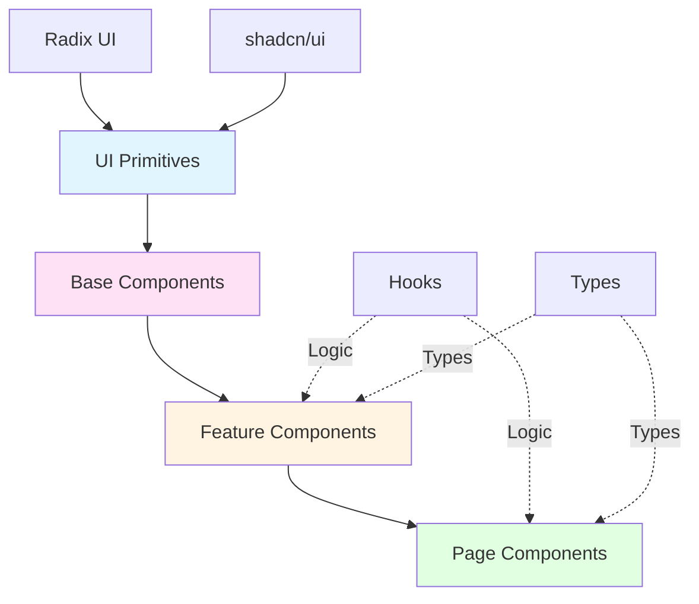
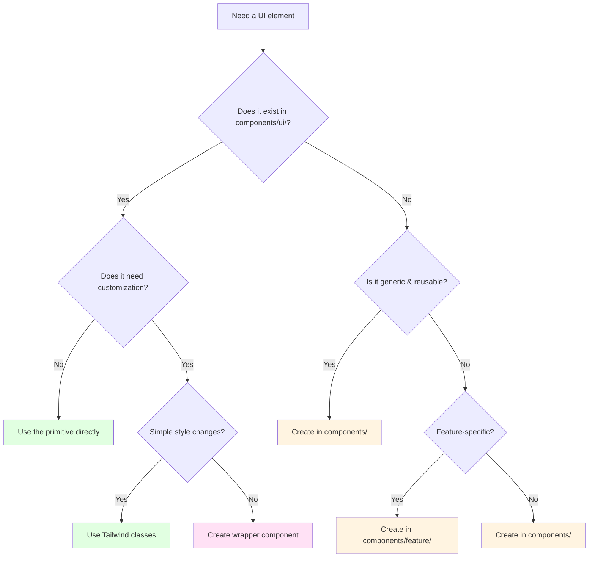

# Component Patterns Guide

**Complete guide to building components in TeamFlow**

This guide shows you how to build UI components following established patterns, when to create new components, and how to compose them from primitives.

## Table of Contents

- [Overview](#overview)
- [Component Architecture](#component-architecture)
- [Decision Tree](#decision-tree)
- [UI Primitives](#ui-primitives)
- [Component Composition](#component-composition)
- [Form Patterns](#form-patterns)
- [Dialog Patterns](#dialog-patterns)
- [Common Patterns](#common-patterns)
- [Refactoring Large Components](#refactoring-large-components)
- [Best Practices](#best-practices)

## Overview

**Core principles**:
- ✅ Build components from UI primitives, never modify primitives
- ✅ Keep components under 200 lines
- ✅ Extract logic into custom hooks
- ✅ Compose complex components from simple ones
- ✅ Follow accessibility guidelines

**Component hierarchy**:



## Component Architecture

### Layer 1: UI Primitives (`components/ui/`)

**Never modify these files.** They come from shadcn/ui and are built on Radix UI.

```
components/ui/
  button.tsx        # Button with variants
  card.tsx          # Card layout
  dialog.tsx        # Modal dialogs
  input.tsx         # Form inputs
  select.tsx        # Dropdowns
  ...
```

**Why not modify**:
- Break future shadcn/ui updates
- Create inconsistencies across app
- Make debugging harder

**Instead**: Create wrapper components or use composition.

### Layer 2: Base Components (`components/`)

Reusable components built from primitives:

```
components/
  stats-card.tsx           # Displays statistics
  resizable-dialog/        # Draggable/resizable modal
    resizable-dialog.tsx
    use-resizable-dialog.ts
```

**Characteristics**:
- Generic, reusable across features
- Composed from UI primitives
- May have their own hooks
- No feature-specific logic

### Layer 3: Feature Components (`components/[feature]/`)

Feature-specific components:

```
components/
  task-management/
    task-board.tsx
    task-card.tsx
    task-lane.tsx
    hooks/
      use-task-dnd.ts
  agents/
    agent-form.tsx
```

**Characteristics**:
- Tied to specific domain (tasks, agents, etc.)
- Use feature types from `lib/types/`
- May have feature-specific hooks
- Not reusable across features

### Layer 4: Page Components (`features/[feature]/page.tsx`)

Top-level components for routes:

```
features/
  tasks/
    page.tsx          # /tasks route
  agents/
    page.tsx          # /agents route
```

**Characteristics**:
- Orchestrate feature components
- Handle routing and navigation
- Manage page-level state
- Should be thin - delegate to feature components

## Decision Tree

**When to create a new component**:



**Quick reference**:

| Scenario | Action | Location |
|----------|--------|----------|
| Button with different color | Use primitive with Tailwind | `<Button className="bg-red-500">` |
| Card with custom header | Compose from primitives | Same file |
| Reusable stats display | Create base component | `components/stats-card.tsx` |
| Task-specific card | Create feature component | `components/task-management/task-card.tsx` |
| Draggable dialog | Create enhanced wrapper | `components/resizable-dialog/` |
| Feature page | Create page component | `features/tasks/page.tsx` |

## UI Primitives

### Using Primitives Directly

```typescript
import { Button } from "@/components/ui/button"
import { Card, CardContent, CardHeader, CardTitle } from "@/components/ui/card"
import { Input } from "@/components/ui/input"

export function SimpleForm() {
  return (
    <Card>
      <CardHeader>
        <CardTitle>User Profile</CardTitle>
      </CardHeader>
      <CardContent>
        <Input placeholder="Enter name" />
        <Button>Save</Button>
      </CardContent>
    </Card>
  )
}
```

### Customizing with Tailwind

```typescript
import { Button } from "@/components/ui/button"

export function ActionButtons() {
  return (
    <div className="flex gap-2">
      {/* Default button */}
      <Button>Default</Button>
      
      {/* Custom colors via Tailwind */}
      <Button className="bg-green-600 hover:bg-green-700">
        Success
      </Button>
      
      {/* Custom size */}
      <Button className="px-8 py-6 text-lg">
        Large
      </Button>
      
      {/* Using variants (built into Button) */}
      <Button variant="outline">Outline</Button>
      <Button variant="ghost">Ghost</Button>
      <Button variant="destructive">Delete</Button>
    </div>
  )
}
```

### Creating Wrapper Components

When you need complex customization:

```typescript
// components/action-button.tsx
import { Button } from "@/components/ui/button"
import { Loader2 } from "lucide-react"
import type { ButtonProps } from "@/components/ui/button"

interface ActionButtonProps extends ButtonProps {
  isLoading?: boolean
  loadingText?: string
}

export function ActionButton({
  isLoading = false,
  loadingText = "Loading...",
  children,
  disabled,
  ...props
}: ActionButtonProps) {
  return (
    <Button disabled={disabled || isLoading} {...props}>
      {isLoading ? (
        <>
          <Loader2 className="mr-2 h-4 w-4 animate-spin" />
          {loadingText}
        </>
      ) : (
        children
      )}
    </Button>
  )
}
```

Usage:
```typescript
<ActionButton isLoading={saving} loadingText="Saving...">
  Save Changes
</ActionButton>
```

## Component Composition

### Pattern 1: Compound Components

Build complex UI from simple pieces:

```typescript
import {
  Card,
  CardContent,
  CardDescription,
  CardFooter,
  CardHeader,
  CardTitle,
} from "@/components/ui/card"
import { Badge } from "@/components/ui/badge"
import { Button } from "@/components/ui/button"

interface StatsCardProps {
  title: string
  value: number
  description: string
  trend?: "up" | "down"
  trendValue?: string
}

export function StatsCard({
  title,
  value,
  description,
  trend,
  trendValue,
}: StatsCardProps) {
  return (
    <Card>
      <CardHeader className="flex flex-row items-center justify-between space-y-0 pb-2">
        <CardTitle className="text-sm font-medium">{title}</CardTitle>
        {trend && (
          <Badge variant={trend === "up" ? "default" : "secondary"}>
            {trend === "up" ? "↑" : "↓"} {trendValue}
          </Badge>
        )}
      </CardHeader>
      <CardContent>
        <div className="text-2xl font-bold">{value}</div>
        <CardDescription>{description}</CardDescription>
      </CardContent>
    </Card>
  )
}
```

### Pattern 2: Composition via Children

```typescript
import { Card, CardContent, CardHeader, CardTitle } from "@/components/ui/card"
import { ReactNode } from "react"

interface SectionCardProps {
  title: string
  icon?: ReactNode
  action?: ReactNode
  children: ReactNode
}

export function SectionCard({ title, icon, action, children }: SectionCardProps) {
  return (
    <Card>
      <CardHeader>
        <div className="flex items-center justify-between">
          <div className="flex items-center gap-2">
            {icon}
            <CardTitle>{title}</CardTitle>
          </div>
          {action}
        </div>
      </CardHeader>
      <CardContent>{children}</CardContent>
    </Card>
  )
}
```

Usage:
```typescript
<SectionCard
  title="Recent Tasks"
  icon={<CheckSquare className="h-5 w-5" />}
  action={<Button size="sm">View All</Button>}
>
  <TaskList tasks={recentTasks} />
</SectionCard>
```

### Pattern 3: Render Props

For flexible, reusable components:

```typescript
import { ReactNode } from "react"

interface ListProps<T> {
  items: T[]
  renderItem: (item: T, index: number) => ReactNode
  renderEmpty?: () => ReactNode
  className?: string
}

export function List<T>({
  items,
  renderItem,
  renderEmpty = () => <p>No items</p>,
  className,
}: ListProps<T>) {
  if (items.length === 0) {
    return <div className={className}>{renderEmpty()}</div>
  }

  return (
    <div className={className}>
      {items.map((item, index) => (
        <div key={index}>{renderItem(item, index)}</div>
      ))}
    </div>
  )
}
```

Usage:
```typescript
<List
  items={tasks}
  renderItem={(task) => (
    <Card>
      <CardHeader>
        <CardTitle>{task.title}</CardTitle>
      </CardHeader>
    </Card>
  )}
  renderEmpty={() => <p>No tasks yet. Create one!</p>}
  className="grid gap-4 md:grid-cols-2"
/>
```

## Form Patterns

TeamFlow uses **react-hook-form + Zod** for forms.

### Pattern 1: Simple Form

```typescript
import { useForm } from "react-hook-form"
import { zodResolver } from "@hookform/resolvers/zod"
import { z } from "zod"
import { Button } from "@/components/ui/button"
import { Input } from "@/components/ui/input"
import { Label } from "@/components/ui/label"

// Define schema
const formSchema = z.object({
  title: z.string().min(2, "Title must be at least 2 characters"),
  description: z.string().optional(),
})

type FormData = z.infer<typeof formSchema>

export function TaskForm({ onSubmit }: { onSubmit: (data: FormData) => void }) {
  const {
    register,
    handleSubmit,
    formState: { errors, isSubmitting },
  } = useForm<FormData>({
    resolver: zodResolver(formSchema),
  })

  return (
    <form onSubmit={handleSubmit(onSubmit)} className="space-y-4">
      <div className="space-y-2">
        <Label htmlFor="title">Title</Label>
        <Input
          id="title"
          {...register("title")}
          placeholder="Enter task title"
        />
        {errors.title && (
          <p className="text-sm text-destructive">{errors.title.message}</p>
        )}
      </div>

      <div className="space-y-2">
        <Label htmlFor="description">Description</Label>
        <Input
          id="description"
          {...register("description")}
          placeholder="Optional description"
        />
      </div>

      <Button type="submit" disabled={isSubmitting}>
        {isSubmitting ? "Saving..." : "Save"}
      </Button>
    </form>
  )
}
```

### Pattern 2: Form with Select

```typescript
import { useForm, Controller } from "react-hook-form"
import { zodResolver } from "@hookform/resolvers/zod"
import { z } from "zod"
import {
  Select,
  SelectContent,
  SelectItem,
  SelectTrigger,
  SelectValue,
} from "@/components/ui/select"
import { Label } from "@/components/ui/label"

const formSchema = z.object({
  priority: z.enum(["low", "medium", "high", "urgent"]),
  status: z.enum(["todo", "in-progress", "completed"]),
})

type FormData = z.infer<typeof formSchema>

export function TaskStatusForm({ onSubmit }: { onSubmit: (data: FormData) => void }) {
  const { control, handleSubmit } = useForm<FormData>({
    resolver: zodResolver(formSchema),
    defaultValues: {
      priority: "medium",
      status: "todo",
    },
  })

  return (
    <form onSubmit={handleSubmit(onSubmit)} className="space-y-4">
      <div className="space-y-2">
        <Label>Priority</Label>
        <Controller
          name="priority"
          control={control}
          render={({ field }) => (
            <Select value={field.value} onValueChange={field.onChange}>
              <SelectTrigger>
                <SelectValue />
              </SelectTrigger>
              <SelectContent>
                <SelectItem value="low">Low</SelectItem>
                <SelectItem value="medium">Medium</SelectItem>
                <SelectItem value="high">High</SelectItem>
                <SelectItem value="urgent">Urgent</SelectItem>
              </SelectContent>
            </Select>
          )}
        />
      </div>

      <div className="space-y-2">
        <Label>Status</Label>
        <Controller
          name="status"
          control={control}
          render={({ field }) => (
            <Select value={field.value} onValueChange={field.onChange}>
              <SelectTrigger>
                <SelectValue />
              </SelectTrigger>
              <SelectContent>
                <SelectItem value="todo">To Do</SelectItem>
                <SelectItem value="in-progress">In Progress</SelectItem>
                <SelectItem value="completed">Completed</SelectItem>
              </SelectContent>
            </Select>
          )}
        />
      </div>

      <Button type="submit">Update</Button>
    </form>
  )
}
```

### Pattern 3: Form with Default Values

```typescript
import { useForm } from "react-hook-form"
import { zodResolver } from "@hookform/resolvers/zod"
import { z } from "zod"
import { useEffect } from "react"
import type { Task } from "@/lib/types"

const formSchema = z.object({
  title: z.string().min(2),
  description: z.string().optional(),
})

type FormData = z.infer<typeof formSchema>

interface TaskFormProps {
  task?: Task // Optional: for editing
  onSubmit: (data: FormData) => void
}

export function TaskForm({ task, onSubmit }: TaskFormProps) {
  const { register, handleSubmit, reset } = useForm<FormData>({
    resolver: zodResolver(formSchema),
  })

  // Set default values when editing
  useEffect(() => {
    if (task) {
      reset({
        title: task.title,
        description: task.description,
      })
    }
  }, [task, reset])

  return (
    <form onSubmit={handleSubmit(onSubmit)}>
      {/* Form fields */}
    </form>
  )
}
```

## Dialog Patterns

### Pattern 1: Basic Dialog

```typescript
import { useState } from "react"
import {
  Dialog,
  DialogContent,
  DialogDescription,
  DialogFooter,
  DialogHeader,
  DialogTitle,
  DialogTrigger,
} from "@/components/ui/dialog"
import { Button } from "@/components/ui/button"
import { Input } from "@/components/ui/input"
import { Label } from "@/components/ui/label"

export function CreateItemDialog() {
  const [open, setOpen] = useState(false)
  const [title, setTitle] = useState("")

  const handleSubmit = () => {
    console.log("Creating item:", title)
    setOpen(false)
    setTitle("")
  }

  return (
    <Dialog open={open} onOpenChange={setOpen}>
      <DialogTrigger asChild>
        <Button>Create Item</Button>
      </DialogTrigger>
      <DialogContent>
        <DialogHeader>
          <DialogTitle>Create New Item</DialogTitle>
          <DialogDescription>
            Enter the details for your new item.
          </DialogDescription>
        </DialogHeader>

        <div className="space-y-4">
          <div className="space-y-2">
            <Label htmlFor="title">Title</Label>
            <Input
              id="title"
              value={title}
              onChange={(e) => setTitle(e.target.value)}
              placeholder="Enter title"
            />
          </div>
        </div>

        <DialogFooter>
          <Button variant="outline" onClick={() => setOpen(false)}>
            Cancel
          </Button>
          <Button onClick={handleSubmit}>Create</Button>
        </DialogFooter>
      </DialogContent>
    </Dialog>
  )
}
```

### Pattern 2: ResizableDialog

For draggable, resizable modals:

```typescript
import { useState } from "react"
import { ResizableDialog } from "@/components/resizable-dialog"
import { Button } from "@/components/ui/button"
import { DialogDescription, DialogHeader, DialogTitle } from "@/components/ui/dialog"

export function AdvancedDialog() {
  const [open, setOpen] = useState(false)

  return (
    <>
      <Button onClick={() => setOpen(true)}>Open Dialog</Button>

      <ResizableDialog
        open={open}
        onOpenChange={setOpen}
        defaultSize={{ width: 600, height: 400 }}
        minSize={{ width: 400, height: 300 }}
      >
        <DialogHeader>
          <DialogTitle>Advanced Dialog</DialogTitle>
          <DialogDescription>
            This dialog can be dragged and resized!
          </DialogDescription>
        </DialogHeader>

        <div className="flex-1 overflow-auto p-4">
          {/* Content here */}
        </div>
      </ResizableDialog>
    </>
  )
}
```

### Pattern 3: Confirmation Dialog

```typescript
import {
  AlertDialog,
  AlertDialogAction,
  AlertDialogCancel,
  AlertDialogContent,
  AlertDialogDescription,
  AlertDialogFooter,
  AlertDialogHeader,
  AlertDialogTitle,
} from "@/components/ui/alert-dialog"

interface ConfirmDialogProps {
  open: boolean
  onOpenChange: (open: boolean) => void
  title: string
  description: string
  onConfirm: () => void
}

export function ConfirmDialog({
  open,
  onOpenChange,
  title,
  description,
  onConfirm,
}: ConfirmDialogProps) {
  const handleConfirm = () => {
    onConfirm()
    onOpenChange(false)
  }

  return (
    <AlertDialog open={open} onOpenChange={onOpenChange}>
      <AlertDialogContent>
        <AlertDialogHeader>
          <AlertDialogTitle>{title}</AlertDialogTitle>
          <AlertDialogDescription>{description}</AlertDialogDescription>
        </AlertDialogHeader>
        <AlertDialogFooter>
          <AlertDialogCancel>Cancel</AlertDialogCancel>
          <AlertDialogAction onClick={handleConfirm}>
            Continue
          </AlertDialogAction>
        </AlertDialogFooter>
      </AlertDialogContent>
    </AlertDialog>
  )
}
```

Usage:
```typescript
const [confirmOpen, setConfirmOpen] = useState(false)

<Button onClick={() => setConfirmOpen(true)}>Delete</Button>

<ConfirmDialog
  open={confirmOpen}
  onOpenChange={setConfirmOpen}
  title="Are you sure?"
  description="This action cannot be undone."
  onConfirm={() => deleteItem()}
/>
```

## Common Patterns

### Pattern 1: Empty State

```typescript
import { Card, CardContent } from "@/components/ui/card"
import { FileX } from "lucide-react"
import { Button } from "@/components/ui/button"

interface EmptyStateProps {
  icon?: React.ReactNode
  title: string
  description: string
  action?: {
    label: string
    onClick: () => void
  }
}

export function EmptyState({ icon, title, description, action }: EmptyStateProps) {
  return (
    <Card className="border-dashed">
      <CardContent className="flex flex-col items-center justify-center py-12">
        {icon || <FileX className="h-12 w-12 text-muted-foreground mb-4" />}
        <h3 className="text-lg font-semibold mb-2">{title}</h3>
        <p className="text-sm text-muted-foreground text-center mb-4">
          {description}
        </p>
        {action && (
          <Button onClick={action.onClick}>{action.label}</Button>
        )}
      </CardContent>
    </Card>
  )
}
```

Usage:
```typescript
{tasks.length === 0 ? (
  <EmptyState
    title="No tasks yet"
    description="Create your first task to get started"
    action={{
      label: "Create Task",
      onClick: () => setDialogOpen(true),
    }}
  />
) : (
  <TaskList tasks={tasks} />
)}
```

### Pattern 2: Loading State

```typescript
import { Card, CardContent, CardHeader } from "@/components/ui/card"
import { Skeleton } from "@/components/ui/skeleton"

export function TaskCardSkeleton() {
  return (
    <Card>
      <CardHeader>
        <Skeleton className="h-6 w-3/4" />
      </CardHeader>
      <CardContent className="space-y-3">
        <Skeleton className="h-4 w-full" />
        <Skeleton className="h-4 w-5/6" />
        <div className="flex gap-2">
          <Skeleton className="h-6 w-16" />
          <Skeleton className="h-6 w-16" />
        </div>
      </CardContent>
    </Card>
  )
}

// Usage
{isLoading ? (
  <div className="grid gap-4 md:grid-cols-2">
    <TaskCardSkeleton />
    <TaskCardSkeleton />
    <TaskCardSkeleton />
  </div>
) : (
  <TaskList tasks={tasks} />
)}
```

### Pattern 3: Error State

```typescript
import { AlertCircle } from "lucide-react"
import { Alert, AlertDescription, AlertTitle } from "@/components/ui/alert"
import { Button } from "@/components/ui/button"

interface ErrorStateProps {
  title?: string
  message: string
  retry?: () => void
}

export function ErrorState({
  title = "Something went wrong",
  message,
  retry,
}: ErrorStateProps) {
  return (
    <Alert variant="destructive">
      <AlertCircle className="h-4 w-4" />
      <AlertTitle>{title}</AlertTitle>
      <AlertDescription className="flex items-center justify-between">
        <span>{message}</span>
        {retry && (
          <Button variant="outline" size="sm" onClick={retry}>
            Try Again
          </Button>
        )}
      </AlertDescription>
    </Alert>
  )
}
```

### Pattern 4: Data Table

```typescript
import {
  Table,
  TableBody,
  TableCell,
  TableHead,
  TableHeader,
  TableRow,
} from "@/components/ui/table"
import { Badge } from "@/components/ui/badge"
import type { Task } from "@/lib/types"

interface TaskTableProps {
  tasks: Task[]
  onTaskClick?: (task: Task) => void
}

export function TaskTable({ tasks, onTaskClick }: TaskTableProps) {
  return (
    <Table>
      <TableHeader>
        <TableRow>
          <TableHead>Title</TableHead>
          <TableHead>Status</TableHead>
          <TableHead>Priority</TableHead>
          <TableHead>Assignee</TableHead>
        </TableRow>
      </TableHeader>
      <TableBody>
        {tasks.map((task) => (
          <TableRow
            key={task.id}
            className="cursor-pointer hover:bg-muted/50"
            onClick={() => onTaskClick?.(task)}
          >
            <TableCell className="font-medium">{task.title}</TableCell>
            <TableCell>
              <Badge variant="outline">{task.status}</Badge>
            </TableCell>
            <TableCell>
              <Badge
                variant={task.priority === "urgent" ? "destructive" : "default"}
              >
                {task.priority}
              </Badge>
            </TableCell>
            <TableCell>{task.assignee || "Unassigned"}</TableCell>
          </TableRow>
        ))}
      </TableBody>
    </Table>
  )
}
```

## Refactoring Large Components

When a component exceeds ~200 lines, split it up.

### Before: Monolithic Component (500 lines)

```typescript
// components/task-management.tsx (500 lines)
export function TaskManagement() {
  // 50 lines of state
  // 100 lines of handlers
  // 350 lines of JSX
  return (
    <div>
      {/* Filters */}
      {/* Board */}
      {/* Dialogs */}
    </div>
  )
}
```

### After: Modular Components

```typescript
// components/task-management/index.ts
export { TaskManagementView } from "./task-management-view"

// components/task-management/task-management-view.tsx (150 lines)
import { TaskBoard } from "./task-board"
import { TaskFilters } from "./task-filters"
import { useTasksState } from "./hooks/use-tasks-state"

export function TaskManagement View() {
  const tasksState = useTasksState()

  return (
    <div>
      <TaskFilters {...tasksState} />
      <TaskBoard {...tasksState} />
    </div>
  )
}

// components/task-management/task-board.tsx (100 lines)
import { TaskLane } from "./task-lane"

export function TaskBoard({ tasks, onUpdate }) {
  // Board-specific logic
  return <div>{/* lanes */}</div>
}

// components/task-management/task-lane.tsx (80 lines)
import { TaskCard } from "./task-card"

export function TaskLane({ tasks, status }) {
  // Lane-specific logic
  return <div>{/* cards */}</div>
}

// components/task-management/task-card.tsx (70 lines)
export function TaskCard({ task, onEdit, onDelete }) {
  // Card-specific logic
  return <Card>{/* task details */}</Card>
}

// components/task-management/hooks/use-tasks-state.ts (100 lines)
export function useTasksState() {
  // All state management logic
  const { items: tasks, create, update, remove } = useCRUD(...)
  // Filters, sorting, etc.
  return { tasks, create, update, remove, /* ... */ }
}
```

**Benefits**:
- Each file under 200 lines
- Easy to test individual components
- Clear separation of concerns
- Reusable pieces
- Easier to understand and maintain

## Best Practices

### ✅ Do: Keep Components Small

```typescript
// ✅ Good - focused, single responsibility
export function TaskCard({ task }: { task: Task }) {
  return (
    <Card>
      <CardHeader>
        <CardTitle>{task.title}</CardTitle>
      </CardHeader>
    </Card>
  )
}

// ❌ Bad - doing too much
export function TaskCard({ task, onEdit, onDelete, onShare, onDuplicate }) {
  // 300 lines of logic and JSX
}
```

### ✅ Do: Extract Logic to Hooks

```typescript
// ✅ Good - logic in hook
function useTaskForm(task?: Task) {
  const [title, setTitle] = useState(task?.title || "")
  const [description, setDescription] = useState(task?.description || "")

  const isValid = title.length >= 2
  const reset = () => {
    setTitle("")
    setDescription("")
  }

  return { title, setTitle, description, setDescription, isValid, reset }
}

export function TaskForm() {
  const form = useTaskForm()
  return <div>{/* JSX uses form.* */}</div>
}

// ❌ Bad - all logic in component
export function TaskForm() {
  // 100 lines of logic
  return <div>{/* JSX */}</div>
}
```

### ✅ Do: Use Compound Components

```typescript
// ✅ Good - composable
<Card>
  <CardHeader>
    <CardTitle>Title</CardTitle>
  </CardHeader>
  <CardContent>Content</CardContent>
</Card>

// ❌ Bad - inflexible props
<Card
  title="Title"
  content="Content"
  hasFooter
  footerAlign="right"
  // Too many props!
/>
```

### ✅ Do: Provide Accessible Labels

```typescript
// ✅ Good - accessible
<Label htmlFor="title">Title</Label>
<Input id="title" />

<Button aria-label="Delete task">
  <Trash2 className="h-4 w-4" />
</Button>

// ❌ Bad - missing labels
<Input /> {/* No label */}
<Button>
  <Trash2 /> {/* Icon-only, no aria-label */}
</Button>
```

### ✅ Do: Handle Loading and Error States

```typescript
// ✅ Good - all states handled
function TaskList() {
  if (isLoading) return <TaskListSkeleton />
  if (error) return <ErrorState message={error} retry={refetch} />
  if (tasks.length === 0) return <EmptyState />
  return <div>{tasks.map(...)}</div>
}

// ❌ Bad - only happy path
function TaskList() {
  return <div>{tasks.map(...)}</div> // What if loading or error?
}
```

### ❌ Don't: Modify UI Primitives

```typescript
// ❌ Wrong - editing components/ui/button.tsx
export function Button() {
  // Custom logic added to primitive
}

// ✅ Correct - create wrapper
import { Button as UIButton } from "@/components/ui/button"

export function ActionButton(props) {
  return <UIButton {...props} className="custom-class" />
}
```

### ❌ Don't: Prop Drill Excessively

```typescript
// ❌ Bad - passing through many levels
<Page>
  <Section onUpdate={handleUpdate}>
    <Card onUpdate={handleUpdate}>
      <Form onUpdate={handleUpdate} />
    </Card>
  </Section>
</Page>

// ✅ Good - use context or lift state
const TaskContext = createContext()

<TaskContext.Provider value={{ onUpdate: handleUpdate }}>
  <Page>
    <Section>
      <Card>
        <Form /> {/* Uses context */}
      </Card>
    </Section>
  </Page>
</TaskContext.Provider>
```

## Related Guides

- **[FEATURE_CREATION_GUIDE.md](FEATURE_CREATION_GUIDE.md)** - Complete feature walkthrough
- **[STORAGE_GUIDE.md](STORAGE_GUIDE.md)** - Data persistence patterns
- **[TYPE_SYSTEM_GUIDE.md](TYPE_SYSTEM_GUIDE.md)** - TypeScript patterns
- **[TESTING_GUIDE.md](TESTING_GUIDE.md)** - Testing component patterns

## Summary

**Key takeaways**:

1. **Never modify `components/ui/`** - Create wrappers instead
2. **Keep components under 200 lines** - Split when larger
3. **Extract logic to hooks** - Keep components focused on presentation
4. **Compose from primitives** - Build complex from simple
5. **Handle all states** - Loading, error, empty, success
6. **Accessibility matters** - Labels, ARIA, keyboard nav

**Component hierarchy**:
```
UI Primitives → Base Components → Feature Components → Pages
```

**When in doubt**: Look at existing components like `task-management/` for patterns to follow.

**Questions?** Check other guides or see [ARCHITECTURE.md](ARCHITECTURE.md) for system design.
