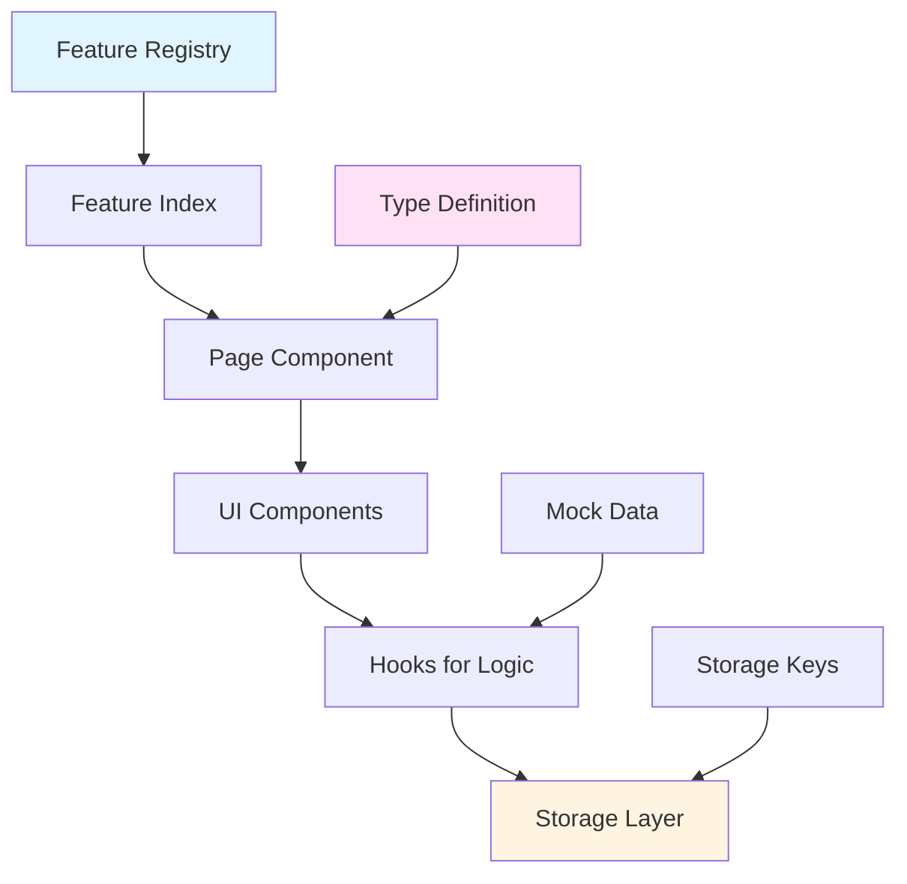

# Feature Creation Guide

**Complete walkthrough for adding new features to TeamFlow**

This guide shows you exactly how to add a complete feature from scratch, using a "Notes" feature as a real-world example. Every step includes complete, runnable code.

## Table of Contents

- [Overview](#overview)
- [Time Estimate](#time-estimate)
- [Prerequisites](#prerequisites)
- [Feature Architecture](#feature-architecture)
- [Step-by-Step Implementation](#step-by-step-implementation)
- [Testing Your Feature](#testing-your-feature)
- [Common Mistakes](#common-mistakes)
- [Troubleshooting](#troubleshooting)
- [Next Steps](#next-steps)

## Overview

**Goal**: Create a note-taking feature with CRUD operations, accessible at `/notes`.

**What you'll build**:
- Full-featured notes page with create, read, update, delete operations
- Automatic persistence to localStorage
- Integration with app navigation
- Type-safe implementation following project patterns

## Time Estimate

- **Simple feature** (like this Notes example): 30-45 minutes
- **Complex feature** (with multiple components): 1-2 hours

## Prerequisites

Before you start, make sure you understand:
- ✅ [Storage abstraction layer](STORAGE_GUIDE.md) - How data persistence works
- ✅ [Component patterns](COMPONENT_PATTERNS.md) - How to build UI components
- ✅ [Type system guide](TYPE_SYSTEM_GUIDE.md) - TypeScript patterns used

Quick check: Have you run `pnpm dev` successfully? If not, see README.md for setup.

## Feature Architecture

Here's how features are organized in TeamFlow:



**Key Principle**: Features are self-contained plugins that register themselves with the app.

## Step-by-Step Implementation

### Step 1: Define the Domain Model (5 min)

Create `lib/types/note.ts`:

```typescript
/**
 * Note type definition
 * Represents a single note in the system
 */
export interface Note {
  /** Unique identifier */
  id: string
  
  /** Note title */
  title: string
  
  /** Note content (supports plain text) */
  content: string
  
  /** Tags for categorization */
  tags: string[]
  
  /** ISO 8601 timestamp */
  createdAt: string
  
  /** ISO 8601 timestamp */
  updatedAt: string
}

/**
 * Form data for creating/editing notes
 * Omits auto-generated fields
 */
export type NoteFormData = Omit<Note, "id" | "createdAt" | "updatedAt">
```

**Update** `lib/types/index.ts` to export the new type:

```typescript
export type { Agent, AgentFormData, AgentStatus, AgentType } from "./agent"
export type { Task, TaskFormData, TaskPriority, TaskStatus } from "./task"
export type { Team, TeamMember, TeamRole } from "./team"
export type { Workflow, WorkflowStep, WorkflowTrigger } from "./workflow"
export type { Note, NoteFormData } from "./note"
```

**Why this matters**:
- Centralized types ensure consistency across the codebase
- TypeScript will catch errors at compile time
- `NoteFormData` type makes forms cleaner (no need for id/timestamps in forms)

### Step 2: Create Mock Data (5 min)

Create `lib/mock-data/notes.ts`:

```typescript
import type { Note } from "@/lib/types"

/**
 * Mock notes data for development
 * Replace with API calls when backend is ready
 */
export const mockNotes: Note[] = [
  {
    id: "1",
    title: "Project Ideas",
    content:
      "Build a note-taking app with AI assistance. Consider features like auto-tagging, smart search, and content suggestions.",
    tags: ["project", "ai", "ideas"],
    createdAt: "2025-01-15T10:00:00Z",
    updatedAt: "2025-01-15T10:00:00Z",
  },
  {
    id: "2",
    title: "Meeting Notes - Team Sync",
    content:
      "Discussed Q1 goals and sprint planning. Action items: review backlog, update timeline, schedule design review.",
    tags: ["meeting", "team"],
    createdAt: "2025-01-16T14:30:00Z",
    updatedAt: "2025-01-16T14:30:00Z",
  },
  {
    id: "3",
    title: "Code Review Checklist",
    content:
      "1. Check TypeScript types\n2. Verify test coverage\n3. Review accessibility\n4. Check performance\n5. Validate error handling",
    tags: ["development", "checklist"],
    createdAt: "2025-01-17T09:15:00Z",
    updatedAt: "2025-01-17T09:15:00Z",
  },
  {
    id: "4",
    title: "Learning Resources",
    content:
      "React 19 features, Next.js 16 app router patterns, Tailwind v4 new features, TypeScript 5.6 updates",
    tags: ["learning", "resources"],
    createdAt: "2025-01-18T11:00:00Z",
    updatedAt: "2025-01-18T11:00:00Z",
  },
]
```

**Update** `lib/mock-data/index.ts`:

```typescript
export { mockAgents } from "./agents"
export { mockTasks } from "./tasks"
export { mockWorkflows } from "./workflows"
export { mockNotes } from "./notes"
```

**Why mock data**:
- Enables development without a backend
- Provides realistic examples for testing
- Easy to replace with API calls later (just change the useCRUD initialization)

### Step 3: Add Storage Key (2 min)

**Edit** `lib/storage/storage-keys.ts` to add the new key:

```typescript
/**
 * Centralized storage keys for localStorage
 * Use these constants instead of string literals
 */
export const STORAGE_KEYS = {
  // App Settings
  THEME: "theme",
  SETTINGS: "settings",
  FEATURES: "features",

  // Data
  AGENTS: "agents",
  TASKS: "tasks",
  WORKFLOWS: "workflows",
  NOTES: "notes", // ← Add this line

  // UI State
  SIDEBAR_OPEN: "sidebar-open",
  TASK_FILTERS: "task-filters",
  TASK_VIEW: "task-view",
} as const

export type StorageKey = (typeof STORAGE_KEYS)[keyof typeof STORAGE_KEYS]
```

**Why centralized keys**:
- Prevents typos (`"noets"` vs `STORAGE_KEYS.NOTES`)
- Makes refactoring easy (change in one place)
- Type-safe (TypeScript autocompletes available keys)

### Step 4: Create Feature Page (15 min)

Create `features/notes/page.tsx`:

```typescript
"use client"

import { useState } from "react"
import { Plus, Tag, Calendar, Trash2, Edit } from "lucide-react"
import { Button } from "@/components/ui/button"
import {
  Card,
  CardContent,
  CardDescription,
  CardFooter,
  CardHeader,
  CardTitle,
} from "@/components/ui/card"
import { Input } from "@/components/ui/input"
import { Textarea } from "@/components/ui/textarea"
import { Badge } from "@/components/ui/badge"
import {
  Dialog,
  DialogContent,
  DialogDescription,
  DialogFooter,
  DialogHeader,
  DialogTitle,
} from "@/components/ui/dialog"
import { Label } from "@/components/ui/label"
import { useCRUD } from "@/lib/hooks"
import { STORAGE_KEYS } from "@/lib/storage"
import { mockNotes } from "@/lib/mock-data"
import type { Note, NoteFormData } from "@/lib/types"
import { formatDateISO } from "@/lib/utils"

export default function NotesPage() {
  // CRUD operations with auto-persistence
  const { items: notes, create, update, remove } = useCRUD<Note>(
    mockNotes,
    STORAGE_KEYS.NOTES
  )

  // Dialog state
  const [dialogOpen, setDialogOpen] = useState(false)
  const [editingNote, setEditingNote] = useState<Note | null>(null)

  // Form state
  const [formData, setFormData] = useState<NoteFormData>({
    title: "",
    content: "",
    tags: [],
  })
  const [tagInput, setTagInput] = useState("")

  // Reset form
  const resetForm = () => {
    setFormData({ title: "", content: "", tags: [] })
    setTagInput("")
    setEditingNote(null)
  }

  // Open dialog for new note
  const handleNewNote = () => {
    resetForm()
    setDialogOpen(true)
  }

  // Open dialog for editing
  const handleEdit = (note: Note) => {
    setEditingNote(note)
    setFormData({
      title: note.title,
      content: note.content,
      tags: note.tags,
    })
    setDialogOpen(true)
  }

  // Save note (create or update)
  const handleSave = () => {
    if (!formData.title.trim()) return

    const now = new Date().toISOString()

    if (editingNote) {
      // Update existing note
      update(editingNote.id, {
        ...formData,
        updatedAt: now,
      })
    } else {
      // Create new note
      create({
        id: Date.now().toString(),
        ...formData,
        createdAt: now,
        updatedAt: now,
      })
    }

    setDialogOpen(false)
    resetForm()
  }

  // Delete note
  const handleDelete = (id: string) => {
    if (confirm("Are you sure you want to delete this note?")) {
      remove(id)
    }
  }

  // Add tag
  const handleAddTag = () => {
    const tag = tagInput.trim().toLowerCase()
    if (tag && !formData.tags.includes(tag)) {
      setFormData({ ...formData, tags: [...formData.tags, tag] })
      setTagInput("")
    }
  }

  // Remove tag
  const handleRemoveTag = (tagToRemove: string) => {
    setFormData({
      ...formData,
      tags: formData.tags.filter((tag) => tag !== tagToRemove),
    })
  }

  return (
    <div className="container mx-auto p-6 max-w-7xl">
      {/* Header */}
      <div className="flex justify-between items-center mb-6">
        <div>
          <h1 className="text-3xl font-bold">Notes</h1>
          <p className="text-muted-foreground mt-1">
            Personal note-taking with tags
          </p>
        </div>
        <Button onClick={handleNewNote} size="lg">
          <Plus className="h-4 w-4 mr-2" />
          New Note
        </Button>
      </div>

      {/* Notes Grid */}
      {notes.length === 0 ? (
        <Card className="p-12 text-center">
          <CardDescription>
            No notes yet. Click "New Note" to get started.
          </CardDescription>
        </Card>
      ) : (
        <div className="grid gap-4 md:grid-cols-2 lg:grid-cols-3">
          {notes.map((note) => (
            <Card key={note.id} className="flex flex-col">
              <CardHeader>
                <CardTitle className="line-clamp-1">{note.title}</CardTitle>
                <CardDescription className="flex items-center gap-1">
                  <Calendar className="h-3 w-3" />
                  {formatDateISO(note.updatedAt)}
                </CardDescription>
              </CardHeader>

              <CardContent className="flex-1">
                <p className="text-sm text-muted-foreground line-clamp-3 whitespace-pre-wrap">
                  {note.content}
                </p>

                {note.tags.length > 0 && (
                  <div className="flex flex-wrap gap-1 mt-3">
                    {note.tags.map((tag) => (
                      <Badge key={tag} variant="secondary" className="text-xs">
                        <Tag className="h-3 w-3 mr-1" />
                        {tag}
                      </Badge>
                    ))}
                  </div>
                )}
              </CardContent>

              <CardFooter className="flex justify-end gap-2">
                <Button
                  variant="ghost"
                  size="sm"
                  onClick={() => handleEdit(note)}
                >
                  <Edit className="h-4 w-4 mr-1" />
                  Edit
                </Button>
                <Button
                  variant="ghost"
                  size="sm"
                  onClick={() => handleDelete(note.id)}
                >
                  <Trash2 className="h-4 w-4 mr-1" />
                  Delete
                </Button>
              </CardFooter>
            </Card>
          ))}
        </div>
      )}

      {/* Create/Edit Dialog */}
      <Dialog open={dialogOpen} onOpenChange={setDialogOpen}>
        <DialogContent className="sm:max-w-[600px]">
          <DialogHeader>
            <DialogTitle>
              {editingNote ? "Edit Note" : "Create Note"}
            </DialogTitle>
            <DialogDescription>
              {editingNote
                ? "Update your note details below."
                : "Add a new note to your collection."}
            </DialogDescription>
          </DialogHeader>

          <div className="space-y-4">
            {/* Title */}
            <div className="space-y-2">
              <Label htmlFor="title">Title</Label>
              <Input
                id="title"
                value={formData.title}
                onChange={(e) =>
                  setFormData({ ...formData, title: e.target.value })
                }
                placeholder="Enter note title"
              />
            </div>

            {/* Content */}
            <div className="space-y-2">
              <Label htmlFor="content">Content</Label>
              <Textarea
                id="content"
                value={formData.content}
                onChange={(e) =>
                  setFormData({ ...formData, content: e.target.value })
                }
                placeholder="Enter note content"
                rows={8}
              />
            </div>

            {/* Tags */}
            <div className="space-y-2">
              <Label htmlFor="tags">Tags</Label>
              <div className="flex gap-2">
                <Input
                  id="tags"
                  value={tagInput}
                  onChange={(e) => setTagInput(e.target.value)}
                  onKeyDown={(e) => {
                    if (e.key === "Enter") {
                      e.preventDefault()
                      handleAddTag()
                    }
                  }}
                  placeholder="Add a tag"
                />
                <Button type="button" onClick={handleAddTag} variant="outline">
                  Add
                </Button>
              </div>

              {formData.tags.length > 0 && (
                <div className="flex flex-wrap gap-2 mt-2">
                  {formData.tags.map((tag) => (
                    <Badge key={tag} variant="secondary">
                      {tag}
                      <button
                        type="button"
                        onClick={() => handleRemoveTag(tag)}
                        className="ml-1 hover:text-destructive"
                      >
                        ×
                      </button>
                    </Badge>
                  ))}
                </div>
              )}
            </div>
          </div>

          <DialogFooter>
            <Button variant="outline" onClick={() => setDialogOpen(false)}>
              Cancel
            </Button>
            <Button onClick={handleSave} disabled={!formData.title.trim()}>
              {editingNote ? "Update" : "Create"}
            </Button>
          </DialogFooter>
        </DialogContent>
      </Dialog>
    </div>
  )
}
```

**Key Points**:
- ✅ Uses `useCRUD` for automatic persistence
- ✅ Uses UI components from `components/ui/`
- ✅ Follows existing page structure patterns
- ✅ Type-safe with proper TypeScript types
- ✅ Accessible with proper labels and semantic HTML

### Step 5: Register the Feature (5 min)

Create `features/notes/index.ts`:

```typescript
import { FileText } from "lucide-react"
import { featureRegistry } from "@/lib/features"
import NotesPage from "./page"

/**
 * Register Notes feature with the app
 * This makes it available in navigation and routing
 */
featureRegistry.register({
  id: "notes",
  name: "Notes",
  description: "Personal note-taking with tags and search",
  icon: FileText,
  enabled: true,
  order: 5, // Position in navigation (after templates)
  component: NotesPage,
})

// Export page component for Next.js routing
export { default } from "./page"
```

**Update** `features/index.ts` to load the feature:

```typescript
/**
 * Feature module loader
 * Import features here to register them with the app
 */
import "./tasks"
import "./agents"
import "./workflows"
import "./templates"
import "./notes" // ← Add this line
```

**What happens now**:
- ✅ Feature is accessible at `/notes`
- ✅ Shows in sidebar navigation automatically
- ✅ Can be toggled on/off in Settings → Features
- ✅ Integrated with app routing

### Step 6: Verify Type Safety (2 min)

Run the TypeScript compiler:

```bash
pnpm typecheck
```

**Expected output**:
```
> teamflow@0.1.0 typecheck
> tsc --noEmit

✓ No type errors found
```

If you see errors, review the error messages and fix them. Common issues:
- Missing imports
- Type mismatches
- Array access without null checks (due to `noUncheckedIndexedAccess`)

## Testing Your Feature

### Manual Testing Checklist

1. **Start dev server**:
   ```bash
   pnpm dev
   ```

2. **Navigate to feature**:
   - Open `http://localhost:3000/notes`
   - Should see the Notes page with mock data

3. **Test CRUD operations**:
   - [ ] Click "New Note" → Dialog opens
   - [ ] Fill in title, content, add tags
   - [ ] Click "Create" → Note appears in grid
   - [ ] Refresh page → Note persists (localStorage)
   - [ ] Click "Edit" on a note → Dialog opens with data
   - [ ] Modify note → Changes save
   - [ ] Click "Delete" → Note is removed

4. **Test navigation**:
   - [ ] Check sidebar → "Notes" link appears
   - [ ] Click sidebar link → Navigates to notes page
   - [ ] Go to Settings → Features → Toggle "Notes" off
   - [ ] Sidebar link disappears
   - [ ] Toggle back on → Link reappears

5. **Test edge cases**:
   - [ ] Try creating note with empty title (button should be disabled)
   - [ ] Add duplicate tags (should be prevented)
   - [ ] Create many notes → Layout adapts responsively
   - [ ] Test on mobile viewport

6. **Check developer tools**:
   - [ ] No console errors
   - [ ] localStorage has `notes` key with JSON data
   - [ ] No React hydration warnings

### Automated Testing

See [TESTING_GUIDE.md](TESTING_GUIDE.md) for patterns on writing tests for your feature.

Example test structure:

```typescript
// tests/features/notes.test.tsx
import { render, screen, fireEvent } from "@testing-library/react"
import NotesPage from "@/features/notes/page"

describe("NotesPage", () => {
  it("renders notes list", () => {
    render(<NotesPage />)
    expect(screen.getByText("Notes")).toBeInTheDocument()
  })

  it("creates a new note", () => {
    render(<NotesPage />)
    fireEvent.click(screen.getByText("New Note"))
    // ... more assertions
  })
})
```

## Common Mistakes

### ❌ Mistake 1: Forgetting to import in `features/index.ts`

**Symptom**: Feature doesn't appear in navigation, `/notes` route 404s.

**Fix**: Make sure you added `import "./notes"` to `features/index.ts`.

### ❌ Mistake 2: Not adding storage key

**Symptom**: Data doesn't persist or throws errors.

**Fix**: Add `NOTES: "notes"` to `STORAGE_KEYS` in `lib/storage/storage-keys.ts`.

### ❌ Mistake 3: Modifying `components/ui/` files

**Symptom**: Merge conflicts, breaks shadcn/ui updates.

**Fix**: Never edit files in `components/ui/`. Create wrapper components instead:

```typescript
// ✅ Correct: Create wrapper
import { Card } from "@/components/ui/card"

export function NoteCard({ note }) {
  return (
    <Card className="custom-styling">
      {/* Your custom content */}
    </Card>
  )
}

// ❌ Wrong: Editing components/ui/card.tsx
```

### ❌ Mistake 4: Using localStorage directly

**Symptom**: No type safety, hard to migrate to backend.

**Fix**: Always use storage abstraction:

```typescript
// ❌ Wrong
localStorage.setItem("notes", JSON.stringify(notes))

// ✅ Correct
import { useCRUD } from "@/lib/hooks"
const { items: notes, create } = useCRUD(mockNotes, STORAGE_KEYS.NOTES)
```

### ❌ Mistake 5: Not handling array access

**Symptom**: TypeScript errors about `T | undefined`.

**Fix**: With `noUncheckedIndexedAccess`, always check:

```typescript
// ❌ Wrong
const firstNote = notes[0]
console.log(firstNote.title) // Error: possibly undefined

// ✅ Correct
const firstNote = notes[0]
if (firstNote) {
  console.log(firstNote.title)
}
```

### ❌ Mistake 6: Missing Dialog titles

**Symptom**: Accessibility warnings in console.

**Fix**: Every Dialog needs a DialogTitle:

```typescript
// ✅ Correct
<Dialog>
  <DialogContent>
    <DialogHeader>
      <DialogTitle>Edit Note</DialogTitle>
    </DialogHeader>
  </DialogContent>
</Dialog>

// If title should be hidden visually
<DialogTitle className="sr-only">Edit Note</DialogTitle>
```

## Troubleshooting

### Issue: Feature doesn't appear in sidebar

**Check**:
1. Is feature imported in `features/index.ts`?
2. Is `enabled: true` in feature registration?
3. Is the feature toggled on in Settings → Features?
4. Did you refresh the page after adding the import?

**Debug**:
```typescript
// Add to features/notes/index.ts temporarily
console.log("Notes feature registered!")
```

### Issue: Data doesn't persist

**Check**:
1. Is storage key added to `STORAGE_KEYS`?
2. Are you using `useCRUD` correctly?
3. Open DevTools → Application → localStorage → Check for your key

**Debug**:
```typescript
// In your component
useEffect(() => {
  console.log("Notes from storage:", notes)
}, [notes])
```

### Issue: TypeScript errors

**Check**:
1. Run `pnpm typecheck` to see all errors
2. Are types exported from `lib/types/index.ts`?
3. Are you handling `T | undefined` from array access?

**Fix**:
```bash
# See all type errors
pnpm typecheck

# Auto-fix linting issues
pnpm lint:fix
```

### Issue: Hydration mismatch

**Symptom**: React warning about server/client mismatch.

**Common causes**:
- Date formatting differences between server/client
- Random values generated during render
- Browser-specific APIs called during render

**Fix**: Use `formatDateISO()` from `lib/utils.ts` for dates, and use `suppressHydrationWarning` if needed.

## Next Steps

### Add More Features to Your Notes

Once basic CRUD works, consider adding:

1. **Search and Filter**
   ```typescript
   const [search, setSearch] = useState("")
   const filteredNotes = notes.filter(note => 
     note.title.toLowerCase().includes(search.toLowerCase()) ||
     note.content.toLowerCase().includes(search.toLowerCase())
   )
   ```

2. **Tag Filtering**
   ```typescript
   const [selectedTag, setSelectedTag] = useState<string | null>(null)
   const filteredNotes = selectedTag
     ? notes.filter(note => note.tags.includes(selectedTag))
     : notes
   ```

3. **Rich Text Editor**
   - Install: `pnpm add @tiptap/react @tiptap/starter-kit`
   - See [TipTap docs](https://tiptap.dev/) for integration

4. **Export/Import**
   ```typescript
   const exportNotes = () => {
     const data = JSON.stringify(notes, null, 2)
     const blob = new Blob([data], { type: "application/json" })
     const url = URL.createObjectURL(blob)
     const a = document.createElement("a")
     a.href = url
     a.download = "notes.json"
     a.click()
   }
   ```

### Refactor if Growing

If your page exceeds 200 lines, split into components:

```
features/notes/
  page.tsx                  # Main page (keeps CRUD logic)
  components/
    note-card.tsx          # Card display
    note-form.tsx          # Create/edit form
    note-filters.tsx       # Search and filter UI
  hooks/
    use-notes-state.ts     # Extract state logic
    use-note-form.ts       # Extract form logic
```

See [COMPONENT_PATTERNS.md](COMPONENT_PATTERNS.md) for refactoring patterns.

### Add Tests

See [TESTING_GUIDE.md](TESTING_GUIDE.md) for testing patterns:

```typescript
// tests/features/notes/notes-page.test.tsx
import { render, screen, fireEvent, waitFor } from "@testing-library/react"
import userEvent from "@testing-library/user-event"
import NotesPage from "@/features/notes/page"

describe("NotesPage", () => {
  it("creates a note with tags", async () => {
    const user = userEvent.setup()
    render(<NotesPage />)
    
    await user.click(screen.getByText("New Note"))
    await user.type(screen.getByLabelText("Title"), "Test Note")
    await user.type(screen.getByLabelText("Content"), "Test content")
    await user.type(screen.getByLabelText("Tags"), "test")
    await user.click(screen.getByText("Add"))
    await user.click(screen.getByText("Create"))
    
    await waitFor(() => {
      expect(screen.getByText("Test Note")).toBeInTheDocument()
    })
  })
})
```

### Connect to Backend (Future)

When backend is ready, replace `useCRUD` with API calls:

```typescript
// Before: Mock data
const { items: notes, create, update, remove } = useCRUD(
  mockNotes,
  STORAGE_KEYS.NOTES
)

// After: API calls
const { data: notes, mutate } = useSWR("/api/notes")

const create = async (note: Omit<Note, "id">) => {
  const response = await fetch("/api/notes", {
    method: "POST",
    body: JSON.stringify(note),
  })
  mutate() // Revalidate
}
```

See `ARCHITECTURE.md` for backend integration patterns.

## Checklist

Before submitting your feature:

- [ ] Type definition in `lib/types/`
- [ ] Type exported in `lib/types/index.ts`
- [ ] Mock data in `lib/mock-data/`
- [ ] Mock data exported in `lib/mock-data/index.ts`
- [ ] Storage key in `lib/storage/storage-keys.ts`
- [ ] Feature page in `features/[name]/page.tsx`
- [ ] Feature registration in `features/[name]/index.ts`
- [ ] Feature imported in `features/index.ts`
- [ ] `pnpm typecheck` passes
- [ ] `pnpm lint` passes
- [ ] Tested in browser (all CRUD operations)
- [ ] Tested navigation (sidebar link works)
- [ ] Tested persistence (data survives refresh)
- [ ] Tested feature toggle (Settings → Features)
- [ ] No console errors or warnings
- [ ] Responsive on mobile
- [ ] Accessible (keyboard navigation, labels)

## Questions?

- **Architecture questions**: See [ARCHITECTURE.md](ARCHITECTURE.md)
- **Storage questions**: See [STORAGE_GUIDE.md](STORAGE_GUIDE.md)
- **Component questions**: See [COMPONENT_PATTERNS.md](COMPONENT_PATTERNS.md)
- **Testing questions**: See [TESTING_GUIDE.md](TESTING_GUIDE.md)
- **TypeScript questions**: See [TYPE_SYSTEM_GUIDE.md](TYPE_SYSTEM_GUIDE.md)

**Happy coding!** 🚀
