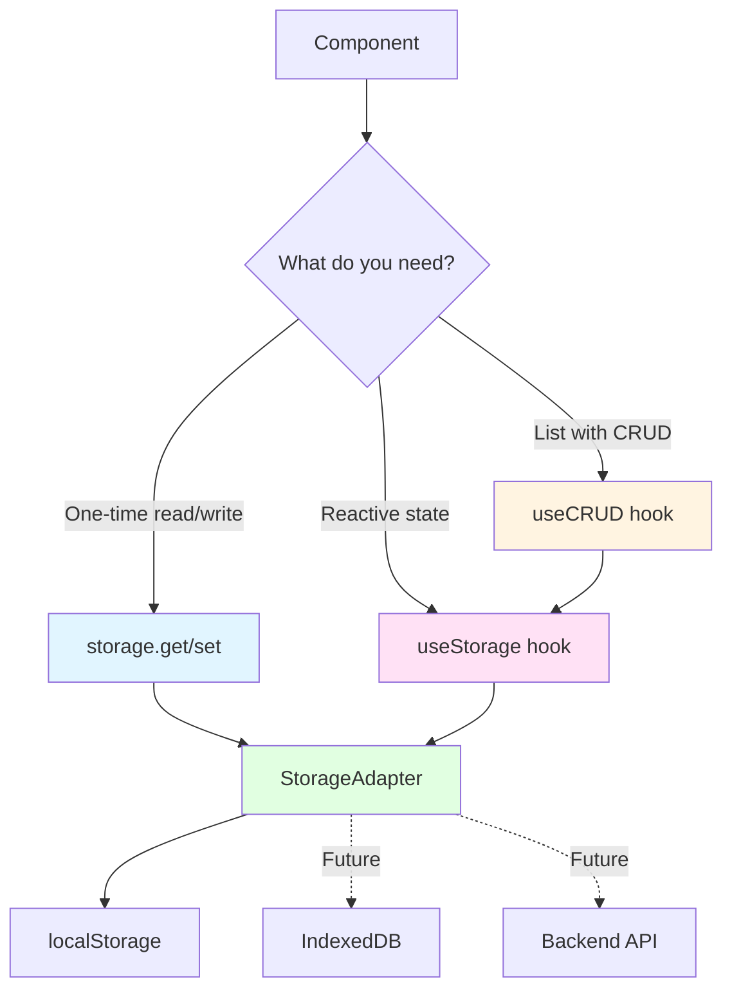
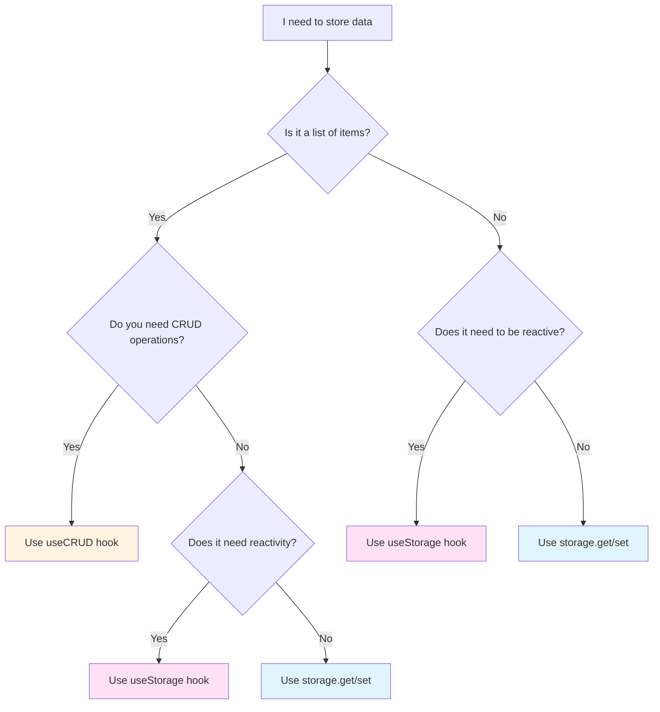

# Storage Abstraction Guide

**Complete guide to data persistence in TeamFlow**

This guide explains how to work with the storage abstraction layer, when to use each method, and how to prepare for backend migration.

## Table of Contents

- [Overview](#overview)
- [Architecture](#architecture)
- [Storage Methods](#storage-methods)
- [Decision Tree](#decision-tree)
- [Usage Patterns](#usage-patterns)
- [Adding Storage Keys](#adding-storage-keys)
- [Migration to Backend](#migration-to-backend)
- [Best Practices](#best-practices)
- [Troubleshooting](#troubleshooting)

## Overview

**Why abstraction matters**:
- ✅ Type-safe reads and writes
- ✅ Automatic JSON serialization/deserialization
- ✅ Built-in error handling (quota exceeded, parse errors)
- ✅ Easy migration to IndexedDB or backend APIs
- ✅ Consistent patterns across codebase

**Core principle**: Never use `localStorage` directly. Always use the abstraction layer.

## Architecture



**Layers**:
1. **Components**: Your UI code
2. **Hooks**: `useStorage`, `useCRUD` - reactive state management
3. **Storage API**: `storage.get()`, `storage.set()` - low-level access
4. **Adapter**: `StorageAdapter` - handles localStorage, error handling
5. **Backend**: Future API integration point

## Storage Methods

TeamFlow provides three ways to work with storage:

### 1. Direct Storage API (`storage`)

**Use when**: One-time reads/writes, non-reactive data

```typescript
import { storage, STORAGE_KEYS } from "@/lib/storage"

// Read with default value
const theme = storage.get(STORAGE_KEYS.THEME, "light")

// Write
storage.set(STORAGE_KEYS.THEME, "dark")

// Remove
storage.remove(STORAGE_KEYS.THEME)

// Clear all (use with caution!)
storage.clear()
```

**Best for**:
- Settings that don't need reactivity
- One-time initialization
- Feature flags
- User preferences

### 2. Reactive State Hook (`useStorage`)

**Use when**: State that syncs with localStorage, needs reactivity

```typescript
import { useStorage } from "@/lib/storage"
import { STORAGE_KEYS } from "@/lib/storage"

function MyComponent() {
  // Similar to useState, but persists to localStorage
  const [theme, setTheme, isLoaded] = useStorage(
    STORAGE_KEYS.THEME,
    "light" // default value
  )

  // isLoaded is false until hydration completes (prevents SSR mismatches)
  if (!isLoaded) {
    return <div>Loading...</div>
  }

  return (
    <button onClick={() => setTheme(theme === "light" ? "dark" : "light")}>
      Toggle theme (current: {theme})
    </button>
  )
}
```

**Best for**:
- Toggle states
- User preferences that affect UI
- Form data that should persist
- Single values that need reactivity

### 3. CRUD Operations Hook (`useCRUD`)

**Use when**: Managing lists with create, update, delete operations

```typescript
import { useCRUD } from "@/lib/hooks"
import { STORAGE_KEYS } from "@/lib/storage"
import { mockTasks } from "@/lib/mock-data"
import type { Task } from "@/lib/types"

function TasksComponent() {
  const { items, create, update, remove } = useCRUD<Task>(
    mockTasks, // Initial data (used if localStorage is empty)
    STORAGE_KEYS.TASKS
  )

  const handleCreate = () => {
    create({
      id: Date.now().toString(),
      title: "New task",
      status: "todo",
      // ... other fields
    })
  }

  const handleUpdate = (taskId: string) => {
    update(taskId, { status: "completed" })
  }

  const handleDelete = (taskId: string) => {
    remove(taskId)
  }

  return (
    <div>
      {items.map((task) => (
        <div key={task.id}>
          {task.title}
          <button onClick={() => handleUpdate(task.id)}>Complete</button>
          <button onClick={() => handleDelete(task.id)}>Delete</button>
        </div>
      ))}
      <button onClick={handleCreate}>Add Task</button>
    </div>
  )
}
```

**Best for**:
- Lists of items (tasks, agents, notes, etc.)
- Full CRUD operations
- Data that needs automatic persistence
- Features with complex state management

## Decision Tree

**Choose your storage method**:



**Quick reference**:

| Scenario | Method | Example |
|----------|--------|---------|
| Theme preference | `storage.get/set` | `storage.set(STORAGE_KEYS.THEME, "dark")` |
| Sidebar open/closed state | `useStorage` | `const [open, setOpen] = useStorage(STORAGE_KEYS.SIDEBAR_OPEN, true)` |
| List of tasks | `useCRUD` | `const { items, create, update } = useCRUD(mockTasks, STORAGE_KEYS.TASKS)` |
| Feature toggles | `useStorage` | `const [enabled, setEnabled] = useStorage(STORAGE_KEYS.FEATURES, {})` |
| User settings object | `useStorage` | `const [settings, setSettings] = useStorage(STORAGE_KEYS.SETTINGS, defaultSettings)` |
| List of agents | `useCRUD` | `const { items, create, remove } = useCRUD(mockAgents, STORAGE_KEYS.AGENTS)` |

## Usage Patterns

### Pattern 1: Simple Toggle

```typescript
import { useStorage } from "@/lib/storage"
import { STORAGE_KEYS } from "@/lib/storage"
import { Switch } from "@/components/ui/switch"

function FeatureToggle() {
  const [enabled, setEnabled] = useStorage(
    STORAGE_KEYS.FEATURES_TASKS, 
    true
  )

  return (
    <Switch 
      checked={enabled} 
      onCheckedChange={setEnabled}
    />
  )
}
```

### Pattern 2: Settings Object

```typescript
import { useStorage } from "@/lib/storage"
import { STORAGE_KEYS } from "@/lib/storage"

interface AppSettings {
  theme: "light" | "dark"
  sidebarOpen: boolean
  notificationsEnabled: boolean
}

const defaultSettings: AppSettings = {
  theme: "light",
  sidebarOpen: true,
  notificationsEnabled: true,
}

function SettingsPanel() {
  const [settings, setSettings] = useStorage(
    STORAGE_KEYS.SETTINGS,
    defaultSettings
  )

  const updateSetting = <K extends keyof AppSettings>(
    key: K,
    value: AppSettings[K]
  ) => {
    setSettings({ ...settings, [key]: value })
  }

  return (
    <div>
      <Switch
        checked={settings.theme === "dark"}
        onCheckedChange={(checked) =>
          updateSetting("theme", checked ? "dark" : "light")
        }
      />
    </div>
  )
}
```

### Pattern 3: CRUD with Filtering

```typescript
import { useCRUD } from "@/lib/hooks"
import { STORAGE_KEYS } from "@/lib/storage"
import { mockTasks } from "@/lib/mock-data"
import type { Task } from "@/lib/types"
import { useMemo, useState } from "react"

function TaskList() {
  const { items: tasks, create, update, remove } = useCRUD<Task>(
    mockTasks,
    STORAGE_KEYS.TASKS
  )

  const [filter, setFilter] = useState<"all" | "active" | "completed">("all")

  // Derived state - doesn't need persistence
  const filteredTasks = useMemo(() => {
    if (filter === "all") return tasks
    if (filter === "active") return tasks.filter(t => t.status !== "completed")
    return tasks.filter(t => t.status === "completed")
  }, [tasks, filter])

  return (
    <div>
      <select value={filter} onChange={(e) => setFilter(e.target.value as any)}>
        <option value="all">All</option>
        <option value="active">Active</option>
        <option value="completed">Completed</option>
      </select>

      {filteredTasks.map((task) => (
        <div key={task.id}>{task.title}</div>
      ))}
    </div>
  )
}
```

### Pattern 4: Optimistic Updates

```typescript
import { useCRUD } from "@/lib/hooks"
import { STORAGE_KEYS } from "@/lib/storage"
import { mockAgents } from "@/lib/mock-data"
import type { Agent } from "@/lib/types"

function AgentsList() {
  const { items: agents, update } = useCRUD<Agent>(
    mockAgents,
    STORAGE_KEYS.AGENTS
  )

  const toggleAgentStatus = async (agentId: string) => {
    const agent = agents.find(a => a.id === agentId)
    if (!agent) return

    // Optimistic update - UI updates immediately
    const newStatus = agent.status === "active" ? "inactive" : "active"
    update(agentId, { status: newStatus })

    // When backend is ready, add API call here
    // If API fails, revert the update
    try {
      // await fetch(`/api/agents/${agentId}`, { ... })
    } catch (error) {
      // Revert on error
      update(agentId, { status: agent.status })
    }
  }

  return (
    <div>
      {agents.map((agent) => (
        <button key={agent.id} onClick={() => toggleAgentStatus(agent.id)}>
          {agent.status}
        </button>
      ))}
    </div>
  )
}
```

### Pattern 5: Bulk Operations

```typescript
import { useCRUD } from "@/lib/hooks"
import { STORAGE_KEYS } from "@/lib/storage"
import { mockTasks } from "@/lib/mock-data"
import type { Task } from "@/lib/types"

function BulkTaskActions() {
  const { items: tasks, update, remove } = useCRUD<Task>(
    mockTasks,
    STORAGE_KEYS.TASKS
  )

  const [selected, setSelected] = useState<string[]>([])

  const completeSelected = () => {
    selected.forEach((id) => {
      update(id, { status: "completed" })
    })
    setSelected([])
  }

  const deleteSelected = () => {
    selected.forEach((id) => {
      remove(id)
    })
    setSelected([])
  }

  return (
    <div>
      <button onClick={completeSelected}>Complete Selected</button>
      <button onClick={deleteSelected}>Delete Selected</button>

      {tasks.map((task) => (
        <label key={task.id}>
          <input
            type="checkbox"
            checked={selected.includes(task.id)}
            onChange={(e) => {
              if (e.target.checked) {
                setSelected([...selected, task.id])
              } else {
                setSelected(selected.filter((id) => id !== task.id))
              }
            }}
          />
          {task.title}
        </label>
      ))}
    </div>
  )
}
```

## Adding Storage Keys

### Step 1: Add to Storage Keys

Edit `lib/storage/storage-keys.ts`:

```typescript
export const STORAGE_KEYS = {
  // App Settings
  THEME: "theme",
  SETTINGS: "settings",
  FEATURES: "features",

  // Data
  AGENTS: "agents",
  TASKS: "tasks",
  WORKFLOWS: "workflows",
  NOTES: "notes", // ← Add your new key here

  // UI State
  SIDEBAR_OPEN: "sidebar-open",
  TASK_FILTERS: "task-filters",
  TASK_VIEW: "task-view",
} as const

export type StorageKey = (typeof STORAGE_KEYS)[keyof typeof STORAGE_KEYS]
```

**Key naming conventions**:
- Use SCREAMING_SNAKE_CASE for the constant
- Use kebab-case for the string value
- Group related keys together (Data, Settings, UI State)
- Be descriptive but concise

### Step 2: Use the Key

```typescript
import { useCRUD } from "@/lib/hooks"
import { STORAGE_KEYS } from "@/lib/storage"
import { mockNotes } from "@/lib/mock-data"
import type { Note } from "@/lib/types"

function NotesComponent() {
  const { items: notes } = useCRUD<Note>(
    mockNotes,
    STORAGE_KEYS.NOTES // ← TypeScript will autocomplete this
  )

  return <div>{notes.length} notes</div>
}
```

**Why constants**:
- Autocomplete in your editor
- Compile-time errors for typos
- Easy refactoring (change in one place)
- Type safety

## Migration to Backend

When you're ready to connect to a backend API, the storage abstraction makes migration easy.

### Current: localStorage

```typescript
import { useCRUD } from "@/lib/hooks"
import { STORAGE_KEYS } from "@/lib/storage"
import { mockTasks } from "@/lib/mock-data"
import type { Task } from "@/lib/types"

function TasksComponent() {
  const { items: tasks, create, update, remove } = useCRUD<Task>(
    mockTasks,
    STORAGE_KEYS.TASKS
  )

  // CRUD operations work with localStorage
}
```

### Future: API Integration (Option 1 - SWR)

```typescript
import useSWR from "swr"
import type { Task } from "@/lib/types"

function TasksComponent() {
  const { data: tasks, mutate } = useSWR<Task[]>("/api/tasks")

  const create = async (task: Omit<Task, "id">) => {
    const response = await fetch("/api/tasks", {
      method: "POST",
      headers: { "Content-Type": "application/json" },
      body: JSON.stringify(task),
    })
    mutate() // Revalidate
  }

  const update = async (id: string, updates: Partial<Task>) => {
    await fetch(`/api/tasks/${id}`, {
      method: "PATCH",
      headers: { "Content-Type": "application/json" },
      body: JSON.stringify(updates),
    })
    mutate()
  }

  const remove = async (id: string) => {
    await fetch(`/api/tasks/${id}`, {
      method: "DELETE",
    })
    mutate()
  }

  // Same interface, different implementation!
}
```

### Future: API Integration (Option 2 - React Query)

```typescript
import { useQuery, useMutation, useQueryClient } from "@tanstack/react-query"
import type { Task } from "@/lib/types"

function TasksComponent() {
  const queryClient = useQueryClient()
  
  const { data: tasks } = useQuery({
    queryKey: ["tasks"],
    queryFn: () => fetch("/api/tasks").then(r => r.json()),
  })

  const createMutation = useMutation({
    mutationFn: (task: Omit<Task, "id">) =>
      fetch("/api/tasks", {
        method: "POST",
        body: JSON.stringify(task),
      }).then(r => r.json()),
    onSuccess: () => {
      queryClient.invalidateQueries({ queryKey: ["tasks"] })
    },
  })

  const create = (task: Omit<Task, "id">) => {
    createMutation.mutate(task)
  }

  // Similar for update and remove
}
```

### Future: Hybrid Approach (Offline-First)

```typescript
import { useCRUD } from "@/lib/hooks"
import { STORAGE_KEYS } from "@/lib/storage"
import { mockTasks } from "@/lib/mock-data"
import type { Task } from "@/lib/types"
import { useEffect } from "react"

function TasksComponent() {
  // Keep using localStorage for instant updates
  const { items: tasks, create: createLocal, update: updateLocal } = useCRUD<Task>(
    mockTasks,
    STORAGE_KEYS.TASKS
  )

  // Sync with backend in background
  useEffect(() => {
    async function syncWithBackend() {
      try {
        const response = await fetch("/api/tasks")
        const serverTasks = await response.json()
        // Merge logic here (last-write-wins, CRDTs, etc.)
      } catch (error) {
        console.error("Sync failed, using local data")
      }
    }
    
    syncWithBackend()
  }, [])

  const create = async (task: Omit<Task, "id">) => {
    // Optimistic update
    const newTask = { ...task, id: Date.now().toString() }
    createLocal(newTask)

    // Sync to server
    try {
      await fetch("/api/tasks", {
        method: "POST",
        body: JSON.stringify(task),
      })
    } catch (error) {
      // Handle error (retry, show notification, etc.)
    }
  }

  // Works offline, syncs when online!
}
```

### Migration Strategy

**Phase 1: Current (localStorage only)**
- All data in localStorage
- Fast, works offline
- No backend needed

**Phase 2: Hybrid (localStorage + API sync)**
- localStorage for instant UI updates
- Background sync to API
- Works offline, syncs when online
- Best user experience

**Phase 3: API-first (with localStorage cache)**
- API is source of truth
- localStorage as cache/offline backup
- Requires backend infrastructure

**Recommended**: Go from Phase 1 → Phase 2 for best UX.

## Best Practices

### ✅ Do: Use Type-Safe Keys

```typescript
// ✅ Correct
import { STORAGE_KEYS } from "@/lib/storage"
storage.set(STORAGE_KEYS.THEME, "dark")

// ❌ Wrong
storage.set("theme", "dark") // No autocomplete, typo-prone
```

### ✅ Do: Provide Default Values

```typescript
// ✅ Correct - always provide a default
const theme = storage.get(STORAGE_KEYS.THEME, "light")
const [tasks, setTasks] = useStorage(STORAGE_KEYS.TASKS, [])

// ❌ Wrong - could be undefined
const theme = storage.get(STORAGE_KEYS.THEME)
```

### ✅ Do: Handle Loading States

```typescript
// ✅ Correct - wait for hydration
const [theme, setTheme, isLoaded] = useStorage(STORAGE_KEYS.THEME, "light")

if (!isLoaded) {
  return <div>Loading...</div>
}

// ❌ Wrong - could cause hydration mismatch
return <div>{theme}</div>
```

### ✅ Do: Use useMemo for Derived State

```typescript
// ✅ Correct - derive, don't duplicate
const { items: tasks } = useCRUD(mockTasks, STORAGE_KEYS.TASKS)
const completedTasks = useMemo(
  () => tasks.filter(t => t.status === "completed"),
  [tasks]
)

// ❌ Wrong - duplicating state
const [tasks, setTasks] = useStorage(STORAGE_KEYS.TASKS, [])
const [completedTasks, setCompletedTasks] = useStorage(STORAGE_KEYS.COMPLETED_TASKS, [])
```

### ✅ Do: Clean Up When Removing Features

```typescript
// When removing a feature, clean up its storage
import { storage, STORAGE_KEYS } from "@/lib/storage"

function removeFeature() {
  storage.remove(STORAGE_KEYS.NOTES)
  // Also clean up related keys
  storage.remove(STORAGE_KEYS.NOTES_FILTERS)
}
```

### ❌ Don't: Store Sensitive Data

```typescript
// ❌ NEVER store sensitive data in localStorage
storage.set(STORAGE_KEYS.PASSWORD, "secret123") // NO!
storage.set(STORAGE_KEYS.API_KEY, "key123") // NO!

// ✅ Use secure, httpOnly cookies or backend session
// localStorage is accessible by any JavaScript on the page
```

### ❌ Don't: Store Large Data

```typescript
// ❌ localStorage has 5-10MB limit
storage.set(STORAGE_KEYS.IMAGES, largeImageArray) // May fail

// ✅ Use IndexedDB for large data (future enhancement)
// Or store IDs and fetch from server when needed
```

### ❌ Don't: Directly Mutate State

```typescript
const { items: tasks, update } = useCRUD(mockTasks, STORAGE_KEYS.TASKS)

// ❌ Wrong - mutating doesn't trigger updates
tasks[0]!.title = "New title"

// ✅ Correct - use update method
const task = tasks[0]
if (task) {
  update(task.id, { title: "New title" })
}
```

## Troubleshooting

### Issue: Data doesn't persist

**Symptoms**:
- Changes disappear on refresh
- localStorage is empty

**Debug**:
```typescript
// Check if data is being written
import { storage, STORAGE_KEYS } from "@/lib/storage"

useEffect(() => {
  console.log("Current tasks:", storage.get(STORAGE_KEYS.TASKS))
}, [])
```

**Common causes**:
1. Storage key not added to `STORAGE_KEYS`
2. Using wrong key name
3. Browser in private/incognito mode (localStorage disabled)
4. Storage quota exceeded

**Fix**:
```typescript
// Verify key exists
console.log(STORAGE_KEYS.TASKS) // Should print "tasks"

// Check browser storage
// DevTools → Application → localStorage → localhost:3000
```

### Issue: Hydration mismatch

**Symptoms**:
- React warning about server/client HTML mismatch
- Flickering on page load

**Cause**: Server renders with default value, client loads from localStorage

**Fix**: Use the `isLoaded` flag from `useStorage`:

```typescript
// ✅ Correct
const [theme, setTheme, isLoaded] = useStorage(STORAGE_KEYS.THEME, "light")

if (!isLoaded) {
  return null // or skeleton
}

return <div>{theme}</div>

// ❌ Wrong - can cause hydration mismatch
const [theme] = useStorage(STORAGE_KEYS.THEME, "light")
return <div>{theme}</div>
```

### Issue: State not updating

**Symptoms**:
- UI doesn't reflect changes
- Console shows correct data

**Causes**:
1. Not using the setter from hook
2. Mutating state directly
3. Missing dependency in useMemo/useEffect

**Fix**:
```typescript
// ✅ Correct
const [tasks, setTasks] = useStorage(STORAGE_KEYS.TASKS, [])
setTasks([...tasks, newTask]) // Creates new array

// ❌ Wrong
tasks.push(newTask) // Mutation doesn't trigger update
```

### Issue: Storage quota exceeded

**Symptoms**:
- Error: "QuotaExceededError"
- Data stops saving

**Debug**:
```typescript
// Check storage usage
const checkStorageUsage = () => {
  let total = 0
  for (let key in localStorage) {
    if (localStorage.hasOwnProperty(key)) {
      total += localStorage[key]!.length + key.length
    }
  }
  console.log(`Storage used: ${(total / 1024).toFixed(2)} KB`)
}
```

**Fix**:
1. Delete unused data
2. Compress data before storing
3. Use IndexedDB for large datasets (future enhancement)
4. Implement data cleanup/archiving

```typescript
// Clean up old data
const cleanOldData = () => {
  const tasks = storage.get(STORAGE_KEYS.TASKS, [])
  const oneMonthAgo = Date.now() - 30 * 24 * 60 * 60 * 1000
  
  const recentTasks = tasks.filter(task => {
    const createdAt = new Date(task.createdAt).getTime()
    return createdAt > oneMonthAgo
  })
  
  storage.set(STORAGE_KEYS.TASKS, recentTasks)
}
```

### Issue: Type errors with useCRUD

**Symptoms**:
- TypeScript errors about types not matching
- `T | undefined` errors

**Common causes**:
1. Not providing type parameter
2. Array access without null check

**Fix**:
```typescript
// ✅ Correct - explicit type parameter
const { items: tasks } = useCRUD<Task>(mockTasks, STORAGE_KEYS.TASKS)

// With noUncheckedIndexedAccess
const firstTask = tasks[0]
if (firstTask) {
  console.log(firstTask.title) // Safe
}

// ❌ Wrong - missing type parameter
const { items: tasks } = useCRUD(mockTasks, STORAGE_KEYS.TASKS)

// ❌ Wrong - no null check
console.log(tasks[0].title) // Error: possibly undefined
```

## Performance Considerations

### localStorage is Synchronous

**Issue**: Large reads/writes block the main thread

**Solution**: Keep data size reasonable
```typescript
// ✅ Good - store IDs, fetch details on demand
storage.set(STORAGE_KEYS.RECENT_ITEMS, ["id1", "id2", "id3"])

// ❌ Bad - storing huge objects
storage.set(STORAGE_KEYS.ALL_DATA, {
  tasks: [...1000 tasks...],
  agents: [...1000 agents...],
  // etc.
})
```

### Avoid Frequent Updates

**Issue**: Each `set()` call triggers serialization + disk write

**Solution**: Batch updates
```typescript
// ✅ Good - batch update
const bulkUpdate = (updates: Array<{ id: string; data: Partial<Task> }>) => {
  const tasks = storage.get(STORAGE_KEYS.TASKS, [])
  const updatedTasks = tasks.map(task => {
    const update = updates.find(u => u.id === task.id)
    return update ? { ...task, ...update.data } : task
  })
  storage.set(STORAGE_KEYS.TASKS, updatedTasks)
}

// ❌ Bad - multiple writes
updates.forEach(({ id, data }) => {
  update(id, data) // Each triggers a write
})
```

### Use Debouncing for Rapid Updates

```typescript
import { useMemo } from "react"
import { debounce } from "lodash"

function SearchComponent() {
  const [search, setSearch] = useStorage(STORAGE_KEYS.SEARCH_QUERY, "")

  // Debounce storage writes
  const debouncedSetSearch = useMemo(
    () => debounce(setSearch, 300),
    [setSearch]
  )

  return (
    <input
      onChange={(e) => debouncedSetSearch(e.target.value)}
      placeholder="Search..."
    />
  )
}
```

## Related Guides

- **[FEATURE_CREATION_GUIDE.md](FEATURE_CREATION_GUIDE.md)** - Complete feature tutorial using storage
- **[COMPONENT_PATTERNS.md](COMPONENT_PATTERNS.md)** - Component patterns and state management
- **[TYPE_SYSTEM_GUIDE.md](TYPE_SYSTEM_GUIDE.md)** - TypeScript patterns with storage
- **[ARCHITECTURE.md](ARCHITECTURE.md)** - Overall system architecture

## Summary

**Three methods, three use cases**:

| Method | Use Case | Example |
|--------|----------|---------|
| `storage.get/set` | One-time access, non-reactive | Theme preference |
| `useStorage` | Reactive state, single values | Sidebar state |
| `useCRUD` | Lists with CRUD operations | Tasks, agents, notes |

**Key principles**:
- ✅ Always use abstraction (never direct localStorage)
- ✅ Use type-safe keys from `STORAGE_KEYS`
- ✅ Provide default values
- ✅ Handle loading states
- ✅ Plan for backend migration from day one

**Questions?** See related guides above or check [ARCHITECTURE.md](ARCHITECTURE.md) for system design.
