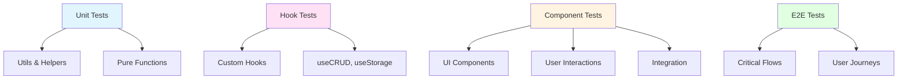
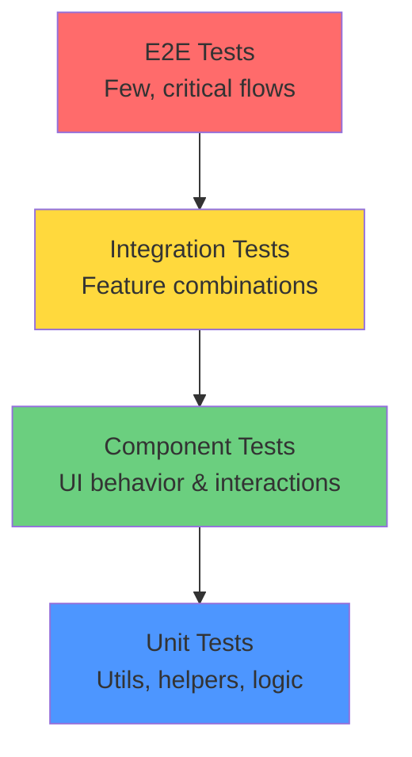

# Testing Guide

**Complete guide to testing in TeamFlow**

This guide covers testing philosophy, setup, and patterns for writing tests in TeamFlow using Vitest and React Testing Library.

## Table of Contents

- [Overview](#overview)
- [Testing Philosophy](#testing-philosophy)
- [Test Setup](#test-setup)
- [Testing Utilities](#testing-utilities)
- [Unit Testing](#unit-testing)
- [Component Testing](#component-testing)
- [Hook Testing](#hook-testing)
- [Integration Testing](#integration-testing)
- [E2E Testing](#e2e-testing-future)
- [Best Practices](#best-practices)
- [Common Patterns](#common-patterns)
- [Troubleshooting](#troubleshooting)

## Overview

**Testing stack**:
- ✅ **Vitest** - Fast unit test runner (Vite-compatible)
- ✅ **React Testing Library** - Component testing utilities
- ✅ **@testing-library/user-event** - User interaction simulation
- ✅ **@testing-library/react-hooks** - Hook testing utilities
- 🔜 **Playwright** - E2E testing (future)

**Test structure**:



## Testing Philosophy

### What to Test

**✅ DO test**:
- Public APIs (component props, hook return values)
- User interactions (clicks, form submissions)
- Data transformations
- Edge cases and error handling
- Accessibility features

**❌ DON'T test**:
- Implementation details
- Third-party library internals
- CSS styles (use visual regression testing instead)
- Private functions (test through public API)

### Testing Pyramid



**Distribution**:
- 70% Unit tests (fast, many)
- 20% Component tests (medium speed)
- 10% Integration/E2E tests (slow, few)

## Test Setup

### Running Tests

```bash
# Run all tests
pnpm test

# Run tests in watch mode
pnpm test:watch

# Run tests with coverage
pnpm test:coverage

# Run specific test file
pnpm test task-card.test.tsx

# Run tests matching pattern
pnpm test --grep="creates task"
```

### Configuration

Tests are configured in `vitest.config.ts`:

```typescript
import { defineConfig } from "vitest/config"
import react from "@vitejs/plugin-react"
import path from "path"

export default defineConfig({
  plugins: [react()],
  test: {
    environment: "jsdom",
    setupFiles: ["./vitest.setup.ts"],
    globals: true,
    css: true,
  },
  resolve: {
    alias: {
      "@": path.resolve(__dirname, "./"),
    },
  },
})
```

### Setup File

`vitest.setup.ts` runs before all tests:

```typescript
import { expect, afterEach, vi } from "vitest"
import { cleanup } from "@testing-library/react"
import * as matchers from "@testing-library/jest-dom/matchers"

// Extend Vitest's expect with jest-dom matchers
expect.extend(matchers)

// Cleanup after each test
afterEach(() => {
  cleanup()
})

// Mock localStorage
const localStorageMock = {
  getItem: vi.fn(),
  setItem: vi.fn(),
  removeItem: vi.fn(),
  clear: vi.fn(),
}
global.localStorage = localStorageMock as any
```

## Testing Utilities

### Custom Render Function

Create `tests/utils/test-utils.tsx`:

```typescript
import { ReactElement } from "react"
import { render, RenderOptions } from "@testing-library/react"

// Add providers here as needed
function AllTheProviders({ children }: { children: React.ReactNode }) {
  return <>{children}</>
}

function customRender(
  ui: ReactElement,
  options?: Omit<RenderOptions, "wrapper">
) {
  return render(ui, { wrapper: AllTheProviders, ...options })
}

export * from "@testing-library/react"
export { customRender as render }
```

### Mock Data Helpers

Create `tests/utils/mock-helpers.ts`:

```typescript
import type { Task, Agent, Note } from "@/lib/types"

export function createMockTask(overrides?: Partial<Task>): Task {
  return {
    id: "test-task-1",
    title: "Test Task",
    description: "Test description",
    status: "todo",
    priority: "medium",
    createdAt: "2025-01-01T00:00:00Z",
    updatedAt: "2025-01-01T00:00:00Z",
    ...overrides,
  }
}

export function createMockAgent(overrides?: Partial<Agent>): Agent {
  return {
    id: "test-agent-1",
    name: "Test Agent",
    type: "conversational",
    status: "active",
    description: "Test description",
    createdAt: "2025-01-01T00:00:00Z",
    ...overrides,
  }
}

export function createMockNote(overrides?: Partial<Note>): Note {
  return {
    id: "test-note-1",
    title: "Test Note",
    content: "Test content",
    tags: ["test"],
    createdAt: "2025-01-01T00:00:00Z",
    updatedAt: "2025-01-01T00:00:00Z",
    ...overrides,
  }
}
```

## Unit Testing

### Testing Pure Functions

```typescript
// lib/utils.ts
export function calculateProgress(completed: number, total: number): number {
  if (total === 0) return 0
  return Math.round((completed / total) * 100)
}

export function formatDate(dateString: string): string {
  return new Date(dateString).toLocaleDateString()
}
```

```typescript
// tests/lib/utils.test.ts
import { describe, it, expect } from "vitest"
import { calculateProgress, formatDate } from "@/lib/utils"

describe("calculateProgress", () => {
  it("returns 0 when total is 0", () => {
    expect(calculateProgress(0, 0)).toBe(0)
  })

  it("calculates percentage correctly", () => {
    expect(calculateProgress(5, 10)).toBe(50)
    expect(calculateProgress(3, 10)).toBe(30)
    expect(calculateProgress(10, 10)).toBe(100)
  })

  it("rounds to nearest integer", () => {
    expect(calculateProgress(1, 3)).toBe(33)
    expect(calculateProgress(2, 3)).toBe(67)
  })
})

describe("formatDate", () => {
  it("formats ISO date string", () => {
    const result = formatDate("2025-01-15T10:00:00Z")
    expect(result).toMatch(/1\/15\/2025/) // Locale-dependent
  })
})
```

### Testing Configuration Objects

```typescript
// tests/lib/config/agent.test.ts
import { describe, it, expect } from "vitest"
import { agentTypeConfig } from "@/lib/config/agent"

describe("agentTypeConfig", () => {
  it("has config for all agent types", () => {
    const types = ["conversational", "analytical", "creative", "autonomous"]
    
    types.forEach((type) => {
      expect(agentTypeConfig[type]).toBeDefined()
      expect(agentTypeConfig[type]?.label).toBeTruthy()
      expect(agentTypeConfig[type]?.icon).toBeDefined()
    })
  })

  it("has unique labels", () => {
    const labels = Object.values(agentTypeConfig).map((config) => config.label)
    const uniqueLabels = new Set(labels)
    expect(labels.length).toBe(uniqueLabels.size)
  })
})
```

## Component Testing

### Basic Component Test

```typescript
// tests/components/stats-card.test.tsx
import { describe, it, expect } from "vitest"
import { render, screen } from "@/tests/utils/test-utils"
import { StatsCard } from "@/components/stats-card"

describe("StatsCard", () => {
  it("renders title and value", () => {
    render(
      <StatsCard
        title="Active Tasks"
        value={42}
        description="Tasks in progress"
      />
    )

    expect(screen.getByText("Active Tasks")).toBeInTheDocument()
    expect(screen.getByText("42")).toBeInTheDocument()
    expect(screen.getByText("Tasks in progress")).toBeInTheDocument()
  })

  it("displays trend badge when provided", () => {
    render(
      <StatsCard
        title="Completed"
        value={10}
        description="This week"
        trend="up"
        trendValue="20%"
      />
    )

    expect(screen.getByText("↑ 20%")).toBeInTheDocument()
  })

  it("does not display trend when not provided", () => {
    render(
      <StatsCard
        title="Total"
        value={100}
        description="All time"
      />
    )

    expect(screen.queryByText(/↑|↓/)).not.toBeInTheDocument()
  })
})
```

### Testing User Interactions

```typescript
// tests/components/task-card.test.tsx
import { describe, it, expect, vi } from "vitest"
import { render, screen } from "@/tests/utils/test-utils"
import userEvent from "@testing-library/user-event"
import { TaskCard } from "@/features/tasks/components/task-card"
import { createMockTask } from "@/tests/utils/mock-helpers"

describe("TaskCard", () => {
  it("calls onEdit when edit button clicked", async () => {
    const user = userEvent.setup()
    const onEdit = vi.fn()
    const task = createMockTask()

    render(<TaskCard task={task} onEdit={onEdit} onDelete={vi.fn()} />)

    const editButton = screen.getByRole("button", { name: /edit/i })
    await user.click(editButton)

    expect(onEdit).toHaveBeenCalledWith(task.id)
    expect(onEdit).toHaveBeenCalledTimes(1)
  })

  it("calls onDelete when delete button clicked", async () => {
    const user = userEvent.setup()
    const onDelete = vi.fn()
    const task = createMockTask()

    render(<TaskCard task={task} onEdit={vi.fn()} onDelete={onDelete} />)

    const deleteButton = screen.getByRole("button", { name: /delete/i })
    await user.click(deleteButton)

    expect(onDelete).toHaveBeenCalledWith(task.id)
  })

  it("displays task priority badge", () => {
    const task = createMockTask({ priority: "urgent" })
    render(<TaskCard task={task} onEdit={vi.fn()} onDelete={vi.fn()} />)

    expect(screen.getByText("urgent")).toBeInTheDocument()
  })
})
```

### Testing Forms

```typescript
// tests/components/agents/agent-form.test.tsx
import { describe, it, expect, vi } from "vitest"
import { render, screen, waitFor } from "@/tests/utils/test-utils"
import userEvent from "@testing-library/user-event"
import { AgentForm } from "@/components/agents/agent-form"

describe("AgentForm", () => {
  it("validates required fields", async () => {
    const user = userEvent.setup()
    const onSubmit = vi.fn()

    render(<AgentForm onSubmit={onSubmit} />)

    // Try to submit without filling fields
    const submitButton = screen.getByRole("button", { name: /create/i })
    await user.click(submitButton)

    // Should show validation errors
    await waitFor(() => {
      expect(screen.getByText(/name is required/i)).toBeInTheDocument()
    })

    expect(onSubmit).not.toHaveBeenCalled()
  })

  it("submits valid form data", async () => {
    const user = userEvent.setup()
    const onSubmit = vi.fn()

    render(<AgentForm onSubmit={onSubmit} />)

    // Fill in form
    await user.type(screen.getByLabelText(/name/i), "Test Agent")
    await user.type(
      screen.getByLabelText(/description/i),
      "Test description"
    )
    
    // Select type
    await user.click(screen.getByLabelText(/type/i))
    await user.click(screen.getByText("Conversational"))

    // Submit
    await user.click(screen.getByRole("button", { name: /create/i }))

    await waitFor(() => {
      expect(onSubmit).toHaveBeenCalledWith(
        expect.objectContaining({
          name: "Test Agent",
          description: "Test description",
          type: "conversational",
        })
      )
    })
  })

  it("populates form with existing agent data", () => {
    const agent = createMockAgent({
      name: "Existing Agent",
      description: "Existing description",
    })

    render(<AgentForm agent={agent} onSubmit={vi.fn()} />)

    expect(screen.getByDisplayValue("Existing Agent")).toBeInTheDocument()
    expect(screen.getByDisplayValue("Existing description")).toBeInTheDocument()
  })
})
```

### Testing Dialogs

```typescript
// tests/components/create-task-dialog.test.tsx
import { describe, it, expect, vi } from "vitest"
import { render, screen, waitFor } from "@/tests/utils/test-utils"
import userEvent from "@testing-library/user-event"
import { CreateTaskDialog } from "@/components/create-task-dialog"

describe("CreateTaskDialog", () => {
  it("opens dialog when trigger clicked", async () => {
    const user = userEvent.setup()
    render(<CreateTaskDialog onCreate={vi.fn()} />)

    const trigger = screen.getByRole("button", { name: /create task/i })
    await user.click(trigger)

    await waitFor(() => {
      expect(screen.getByRole("dialog")).toBeInTheDocument()
      expect(screen.getByText(/new task/i)).toBeInTheDocument()
    })
  })

  it("closes dialog on cancel", async () => {
    const user = userEvent.setup()
    render(<CreateTaskDialog onCreate={vi.fn()} />)

    // Open dialog
    await user.click(screen.getByRole("button", { name: /create task/i }))
    
    // Click cancel
    await user.click(screen.getByRole("button", { name: /cancel/i }))

    await waitFor(() => {
      expect(screen.queryByRole("dialog")).not.toBeInTheDocument()
    })
  })

  it("creates task and closes dialog on submit", async () => {
    const user = userEvent.setup()
    const onCreate = vi.fn()
    render(<CreateTaskDialog onCreate={onCreate} />)

    // Open dialog
    await user.click(screen.getByRole("button", { name: /create task/i }))

    // Fill form
    await user.type(screen.getByLabelText(/title/i), "New Task")
    await user.type(screen.getByLabelText(/description/i), "Task description")

    // Submit
    await user.click(screen.getByRole("button", { name: /create/i }))

    await waitFor(() => {
      expect(onCreate).toHaveBeenCalledWith(
        expect.objectContaining({
          title: "New Task",
          description: "Task description",
        })
      )
      expect(screen.queryByRole("dialog")).not.toBeInTheDocument()
    })
  })
})
```

## Hook Testing

### Testing Custom Hooks

```typescript
// tests/hooks/use-crud.test.ts
import { describe, it, expect, beforeEach, afterEach, vi } from "vitest"
import { renderHook, act } from "@testing-library/react"
import { useCRUD } from "@/lib/hooks/use-crud"
import { STORAGE_KEYS } from "@/lib/storage"
import { createMockTask } from "@/tests/utils/mock-helpers"

describe("useCRUD", () => {
  beforeEach(() => {
    localStorage.clear()
    vi.clearAllMocks()
  })

  afterEach(() => {
    localStorage.clear()
  })

  it("initializes with default data", () => {
    const mockData = [createMockTask()]
    const { result } = renderHook(() =>
      useCRUD(mockData, STORAGE_KEYS.TASKS)
    )

    expect(result.current.items).toEqual(mockData)
  })

  it("creates a new item", () => {
    const { result } = renderHook(() => useCRUD([], STORAGE_KEYS.TASKS))

    const newTask = createMockTask({ id: "new-1", title: "New Task" })

    act(() => {
      result.current.create(newTask)
    })

    expect(result.current.items).toHaveLength(1)
    expect(result.current.items[0]).toEqual(newTask)
  })

  it("updates an existing item", () => {
    const initialTask = createMockTask({ id: "1", title: "Original" })
    const { result } = renderHook(() =>
      useCRUD([initialTask], STORAGE_KEYS.TASKS)
    )

    act(() => {
      result.current.update("1", { title: "Updated" })
    })

    expect(result.current.items[0]?.title).toBe("Updated")
  })

  it("removes an item", () => {
    const task1 = createMockTask({ id: "1" })
    const task2 = createMockTask({ id: "2" })
    const { result } = renderHook(() =>
      useCRUD([task1, task2], STORAGE_KEYS.TASKS)
    )

    act(() => {
      result.current.remove("1")
    })

    expect(result.current.items).toHaveLength(1)
    expect(result.current.items[0]?.id).toBe("2")
  })

  it("persists to localStorage", () => {
    const { result } = renderHook(() => useCRUD([], STORAGE_KEYS.TASKS))

    const newTask = createMockTask()

    act(() => {
      result.current.create(newTask)
    })

    expect(localStorage.setItem).toHaveBeenCalledWith(
      STORAGE_KEYS.TASKS,
      expect.any(String)
    )
  })

  it("loads from localStorage on mount", () => {
    const storedTask = createMockTask({ id: "stored" })
    localStorage.setItem(STORAGE_KEYS.TASKS, JSON.stringify([storedTask]))

    const { result } = renderHook(() => useCRUD([], STORAGE_KEYS.TASKS))

    expect(result.current.items).toHaveLength(1)
    expect(result.current.items[0]?.id).toBe("stored")
  })
})
```

### Testing useStorage Hook

```typescript
// tests/hooks/use-storage.test.ts
import { describe, it, expect, beforeEach, vi } from "vitest"
import { renderHook, act } from "@testing-library/react"
import { useStorage } from "@/lib/storage/use-storage"
import { STORAGE_KEYS } from "@/lib/storage"

describe("useStorage", () => {
  beforeEach(() => {
    localStorage.clear()
    vi.clearAllMocks()
  })

  it("initializes with default value", () => {
    const { result } = renderHook(() =>
      useStorage(STORAGE_KEYS.THEME, "light")
    )

    const [value, , isLoaded] = result.current

    expect(value).toBe("light")
    expect(isLoaded).toBe(true)
  })

  it("updates value", () => {
    const { result } = renderHook(() =>
      useStorage(STORAGE_KEYS.THEME, "light")
    )

    const [, setValue] = result.current

    act(() => {
      setValue("dark")
    })

    const [newValue] = result.current
    expect(newValue).toBe("dark")
  })

  it("persists to localStorage", () => {
    const { result } = renderHook(() =>
      useStorage(STORAGE_KEYS.THEME, "light")
    )

    const [, setValue] = result.current

    act(() => {
      setValue("dark")
    })

    expect(localStorage.setItem).toHaveBeenCalledWith(
      STORAGE_KEYS.THEME,
      JSON.stringify("dark")
    )
  })

  it("loads from localStorage", () => {
    localStorage.setItem(STORAGE_KEYS.THEME, JSON.stringify("dark"))

    const { result } = renderHook(() =>
      useStorage(STORAGE_KEYS.THEME, "light")
    )

    const [value] = result.current
    expect(value).toBe("dark")
  })
})
```

## Integration Testing

### Testing Feature Flows

```typescript
// tests/features/tasks/task-management.test.tsx
import { describe, it, expect, beforeEach } from "vitest"
import { render, screen, waitFor } from "@/tests/utils/test-utils"
import userEvent from "@testing-library/user-event"
import TasksPage from "@/features/tasks/page"

describe("Task Management Flow", () => {
  beforeEach(() => {
    localStorage.clear()
  })

  it("completes full CRUD flow", async () => {
    const user = userEvent.setup()
    render(<TasksPage />)

    // Create task
    await user.click(screen.getByRole("button", { name: /new task/i }))
    await user.type(screen.getByLabelText(/title/i), "Test Task")
    await user.click(screen.getByRole("button", { name: /create/i }))

    await waitFor(() => {
      expect(screen.getByText("Test Task")).toBeInTheDocument()
    })

    // Edit task
    await user.click(screen.getByRole("button", { name: /edit/i }))
    const titleInput = screen.getByLabelText(/title/i)
    await user.clear(titleInput)
    await user.type(titleInput, "Updated Task")
    await user.click(screen.getByRole("button", { name: /update/i }))

    await waitFor(() => {
      expect(screen.getByText("Updated Task")).toBeInTheDocument()
      expect(screen.queryByText("Test Task")).not.toBeInTheDocument()
    })

    // Delete task
    await user.click(screen.getByRole("button", { name: /delete/i }))

    await waitFor(() => {
      expect(screen.queryByText("Updated Task")).not.toBeInTheDocument()
    })
  })

  it("filters tasks by status", async () => {
    const user = userEvent.setup()
    render(<TasksPage />)

    // Create tasks with different statuses
    // ... (create multiple tasks)

    // Apply filter
    await user.click(screen.getByLabelText(/status filter/i))
    await user.click(screen.getByText("Completed"))

    await waitFor(() => {
      const completedTasks = screen.getAllByText(/completed/i)
      expect(completedTasks.length).toBeGreaterThan(0)
    })
  })
})
```

## E2E Testing (Future)

### Playwright Setup (Planned)

```typescript
// e2e/task-management.spec.ts
import { test, expect } from "@playwright/test"

test.describe("Task Management", () => {
  test.beforeEach(async ({ page }) => {
    await page.goto("http://localhost:3000/tasks")
  })

  test("creates a task", async ({ page }) => {
    await page.click('button:has-text("New Task")')
    await page.fill('input[name="title"]', "E2E Test Task")
    await page.fill('textarea[name="description"]', "Test description")
    await page.click('button:has-text("Create")')

    await expect(page.locator("text=E2E Test Task")).toBeVisible()
  })

  test("edits a task", async ({ page }) => {
    // Create task first
    // ...

    await page.click('button[aria-label="Edit task"]')
    await page.fill('input[name="title"]', "Updated Task")
    await page.click('button:has-text("Update")')

    await expect(page.locator("text=Updated Task")).toBeVisible()
  })

  test("deletes a task", async ({ page }) => {
    // Create task first
    // ...

    await page.click('button[aria-label="Delete task"]')
    await page.click('button:has-text("Confirm")')

    await expect(page.locator("text=E2E Test Task")).not.toBeVisible()
  })
})
```

## Best Practices

### ✅ Do: Test User Behavior

```typescript
// ✅ Good - tests what user sees/does
it("shows error when form is invalid", async () => {
  const user = userEvent.setup()
  render(<TaskForm onSubmit={vi.fn()} />)

  await user.click(screen.getByRole("button", { name: /submit/i }))

  expect(screen.getByText(/title is required/i)).toBeInTheDocument()
})

// ❌ Bad - tests implementation
it("sets error state when form is invalid", () => {
  const { result } = renderHook(() => useTaskForm())
  act(() => {
    result.current.validate()
  })
  expect(result.current.errors.title).toBe("Title is required")
})
```

### ✅ Do: Use Accessible Queries

```typescript
// ✅ Good - uses accessible queries (order of preference)
screen.getByRole("button", { name: /submit/i })
screen.getByLabelText(/title/i)
screen.getByPlaceholderText(/enter title/i)
screen.getByText(/hello world/i)

// ❌ Bad - fragile queries
screen.getByTestId("submit-button")
screen.getByClassName("btn-primary")
container.querySelector(".btn")
```

### ✅ Do: Wait for Async Changes

```typescript
// ✅ Good - waits for element
await waitFor(() => {
  expect(screen.getByText("Success")).toBeInTheDocument()
})

// Or use findBy (has built-in waiting)
expect(await screen.findByText("Success")).toBeInTheDocument()

// ❌ Bad - doesn't wait
expect(screen.getByText("Success")).toBeInTheDocument() // May fail
```

### ✅ Do: Clean Up After Tests

```typescript
// ✅ Good - cleanup in setup file (vitest.setup.ts)
afterEach(() => {
  cleanup()
  localStorage.clear()
  vi.clearAllMocks()
})

// Or per-test if needed
afterEach(() => {
  // test-specific cleanup
})
```

### ❌ Don't: Test Implementation Details

```typescript
// ❌ Bad - testing internal state
expect(component.state.isOpen).toBe(true)
expect(instance.handleClick).toHaveBeenCalled()

// ✅ Good - testing observable behavior
expect(screen.getByRole("dialog")).toBeVisible()
expect(mockOnClick).toHaveBeenCalled()
```

### ❌ Don't: Use Snapshot Testing for Components

```typescript
// ❌ Bad - brittle, hard to review
expect(container).toMatchSnapshot()

// ✅ Good - specific assertions
expect(screen.getByText("Hello")).toBeInTheDocument()
expect(screen.getByRole("button")).toBeEnabled()
```

## Common Patterns

### Pattern: Testing Async Operations

```typescript
it("loads data on mount", async () => {
  const mockData = [createMockTask()]
  vi.spyOn(global, "fetch").mockResolvedValue({
    json: async () => mockData,
  } as Response)

  render(<TaskList />)

  expect(screen.getByText(/loading/i)).toBeInTheDocument()

  await waitFor(() => {
    expect(screen.getByText(mockData[0]!.title)).toBeInTheDocument()
  })

  expect(screen.queryByText(/loading/i)).not.toBeInTheDocument()
})
```

### Pattern: Testing Error States

```typescript
it("displays error message on fetch failure", async () => {
  vi.spyOn(global, "fetch").mockRejectedValue(new Error("Failed to fetch"))

  render(<TaskList />)

  await waitFor(() => {
    expect(screen.getByText(/failed to load/i)).toBeInTheDocument()
  })
})
```

### Pattern: Testing Conditional Rendering

```typescript
it("shows empty state when no items", () => {
  render(<TaskList tasks={[]} />)
  expect(screen.getByText(/no tasks yet/i)).toBeInTheDocument()
})

it("shows task list when items exist", () => {
  const tasks = [createMockTask()]
  render(<TaskList tasks={tasks} />)
  expect(screen.getByText(tasks[0]!.title)).toBeInTheDocument()
  expect(screen.queryByText(/no tasks/i)).not.toBeInTheDocument()
})
```

### Pattern: Testing Keyboard Navigation

```typescript
it("navigates with keyboard", async () => {
  const user = userEvent.setup()
  render(<TaskList tasks={mockTasks} />)

  const firstTask = screen.getAllByRole("listitem")[0]!
  firstTask.focus()

  await user.keyboard("{ArrowDown}")
  
  const secondTask = screen.getAllByRole("listitem")[1]!
  expect(secondTask).toHaveFocus()
})
```

## Troubleshooting

### Issue: "Not wrapped in act(...)"

**Cause**: State updates not wrapped in `act()`

**Fix**:
```typescript
// ✅ Correct
await act(async () => {
  result.current.updateValue("new value")
})

// Or use waitFor
await waitFor(() => {
  expect(screen.getByText("new value")).toBeInTheDocument()
})
```

### Issue: "Unable to find element"

**Cause**: Element not rendered or wrong query

**Debug**:
```typescript
// See what's rendered
screen.debug()

// See specific element
screen.debug(screen.getByRole("button"))

// Check available roles
screen.logTestingPlaygroundURL()
```

### Issue: Tests timeout

**Cause**: Async operation not completing

**Fix**:
```typescript
// Increase timeout for specific test
it("slow operation", async () => {
  // ...
}, 10000) // 10 second timeout

// Or use waitFor with timeout
await waitFor(
  () => {
    expect(screen.getByText("Done")).toBeInTheDocument()
  },
  { timeout: 5000 }
)
```

### Issue: localStorage not mocking

**Cause**: Mock not set up in setup file

**Fix**: Ensure `vitest.setup.ts` has localStorage mock:
```typescript
const localStorageMock = {
  getItem: vi.fn(),
  setItem: vi.fn(),
  removeItem: vi.fn(),
  clear: vi.fn(),
}
global.localStorage = localStorageMock as any
```

## Related Guides

- **[FEATURE_CREATION_GUIDE.md](FEATURE_CREATION_GUIDE.md)** - Add features with tests
- **[COMPONENT_PATTERNS.md](COMPONENT_PATTERNS.md)** - Component patterns to test
- **[STORAGE_GUIDE.md](STORAGE_GUIDE.md)** - Testing storage layer
- **[TYPE_SYSTEM_GUIDE.md](TYPE_SYSTEM_GUIDE.md)** - TypeScript in tests

## Summary

**Test the right things**:
- ✅ User behavior
- ✅ Accessibility
- ✅ Edge cases
- ❌ Implementation details

**Use the right tools**:
- Vitest for fast unit tests
- React Testing Library for components
- user-event for realistic interactions
- waitFor for async operations

**Follow the pyramid**:
- Many unit tests (fast)
- Some component tests (medium)
- Few E2E tests (slow)

**Key principles**:
1. Test behavior, not implementation
2. Use accessible queries
3. Wait for async changes
4. Clean up after tests
5. Keep tests focused and readable

**Questions?** Check examples in `tests/components/` or see other guides for patterns.
