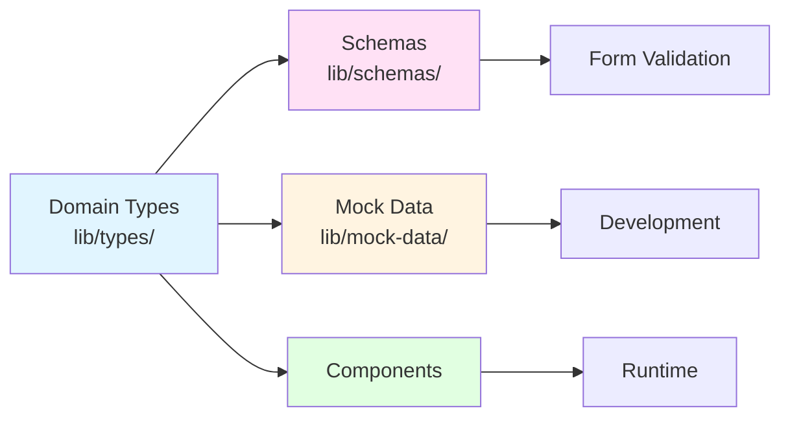

# Type System Guide

**Complete guide to TypeScript patterns in TeamFlow**

This guide covers TypeScript usage, strict mode patterns, type safety strategies, and how to work with TeamFlow's type system.

## Table of Contents

- [Overview](#overview)
- [TypeScript Configuration](#typescript-configuration)
- [Type System Architecture](#type-system-architecture)
- [Adding Types](#adding-types)
- [Working with Strict Mode](#working-with-strict-mode)
- [Zod Schema Patterns](#zod-schema-patterns)
- [Type Utilities](#type-utilities)
- [Common Patterns](#common-patterns)
- [Best Practices](#best-practices)
- [Troubleshooting](#troubleshooting)

## Overview

**TypeScript strictness**:
- ✅ **strict: true** - All strict checks enabled
- ✅ **noUncheckedIndexedAccess: true** - Array access returns `T | undefined`
- ✅ **exactOptionalPropertyTypes: true** - Optional props can't be explicitly `undefined`
- ❌ **No `any`** - Use `unknown` if type is truly unknown
- ❌ **No `@ts-ignore`** - Fix errors, don't suppress them

**Type flow**:



## TypeScript Configuration

### tsconfig.json

```json
{
  "compilerOptions": {
    // Strict type checking
    "strict": true,
    "noUncheckedIndexedAccess": true,
    "exactOptionalPropertyTypes": true,
    "noImplicitAny": true,
    "strictNullChecks": true,
    "strictFunctionTypes": true,
    "strictBindCallApply": true,
    "strictPropertyInitialization": true,
    "noImplicitThis": true,
    "alwaysStrict": true,

    // Module resolution
    "moduleResolution": "bundler",
    "module": "ESNext",
    "target": "ES2022",
    "lib": ["ES2023", "DOM", "DOM.Iterable"],

    // React
    "jsx": "preserve",
    "jsxImportSource": "react",

    // Path mapping
    "baseUrl": ".",
    "paths": {
      "@/*": ["./*"]
    },

    // Other
    "skipLibCheck": true,
    "allowJs": true,
    "resolveJsonModule": true,
    "isolatedModules": true,
    "incremental": true,
    "plugins": [{ "name": "next" }]
  },
  "include": [
    "next-env.d.ts",
    "**/*.ts",
    "**/*.tsx",
    ".next/types/**/*.ts"
  ],
  "exclude": ["node_modules"]
}
```

### Checking Types

```bash
# Run TypeScript compiler (check types without building)
pnpm typecheck

# Expected output on success
> tsc --noEmit
✓ No type errors found

# Fix with linting
pnpm lint:fix
```

## Type System Architecture

### Directory Structure

```
lib/
  types/
    index.ts           # Exports all types
    agent.ts           # Agent types
    task.ts            # Task types
    team.ts            # Team types
    workflow.ts        # Workflow types
    note.ts            # Note types
  schemas/
    agent.ts           # Zod schemas for validation
    task.ts
  config/
    agent.ts           # Type-driven configurations
  mock-data/
    agents.ts          # Mock data using types
    tasks.ts
```

### Type Definition Pattern

Each domain type follows this pattern:

```typescript
// lib/types/task.ts

/**
 * Task priority levels
 */
export type TaskPriority = "low" | "medium" | "high" | "urgent"

/**
 * Task status
 */
export type TaskStatus = "todo" | "in-progress" | "completed" | "blocked"

/**
 * Task entity
 */
export interface Task {
  /** Unique identifier */
  id: string

  /** Task title */
  title: string

  /** Task description */
  description?: string

  /** Current status */
  status: TaskStatus

  /** Priority level */
  priority: TaskPriority

  /** Assigned user ID */
  assignee?: string

  /** Due date (ISO 8601) */
  dueDate?: string

  /** Creation timestamp (ISO 8601) */
  createdAt: string

  /** Last update timestamp (ISO 8601) */
  updatedAt: string

  /** Tags for categorization */
  tags?: string[]
}

/**
 * Form data for creating/editing tasks
 * Omits auto-generated fields (id, timestamps)
 */
export type TaskFormData = Omit<Task, "id" | "createdAt" | "updatedAt">

/**
 * Partial update data
 */
export type TaskUpdate = Partial<Omit<Task, "id" | "createdAt">>
```

**Key points**:
- Use `interface` for object types (extensible)
- Use `type` for unions, intersections, utilities
- Add JSDoc comments for documentation
- Export form data types (without auto-generated fields)
- Export update types (partial updates)

## Adding Types

### Step 1: Define Domain Type

Create `lib/types/note.ts`:

```typescript
/**
 * Note entity for the notes feature
 */
export interface Note {
  /** Unique identifier */
  id: string

  /** Note title */
  title: string

  /** Note content */
  content: string

  /** Tags for organization */
  tags: string[]

  /** Creation timestamp (ISO 8601) */
  createdAt: string

  /** Last update timestamp (ISO 8601) */
  updatedAt: string

  /** Pinned status */
  isPinned?: boolean
}

/**
 * Form data for creating/editing notes
 */
export type NoteFormData = Omit<Note, "id" | "createdAt" | "updatedAt">

/**
 * Partial update for notes
 */
export type NoteUpdate = Partial<Omit<Note, "id" | "createdAt">>
```

### Step 2: Export from Index

Update `lib/types/index.ts`:

```typescript
// Export all domain types
export type { Agent, AgentFormData, AgentStatus, AgentType } from "./agent"
export type { Task, TaskFormData, TaskPriority, TaskStatus } from "./task"
export type { Team, TeamMember, TeamRole } from "./team"
export type { Workflow, WorkflowStep, WorkflowTrigger } from "./workflow"
export type { Note, NoteFormData, NoteUpdate } from "./note" // ← Add this
```

### Step 3: Create Zod Schema (Optional)

If you need validation (forms, API), create `lib/schemas/note.ts`:

```typescript
import { z } from "zod"

/**
 * Note creation/edit schema
 */
export const noteSchema = z.object({
  title: z
    .string()
    .min(2, "Title must be at least 2 characters")
    .max(200, "Title must be less than 200 characters"),

  content: z.string().optional(),

  tags: z.array(z.string()).default([]),

  isPinned: z.boolean().optional(),
})

/**
 * Infer type from schema (should match NoteFormData)
 */
export type NoteSchemaType = z.infer<typeof noteSchema>
```

### Step 4: Create Mock Data

Create `lib/mock-data/notes.ts`:

```typescript
import type { Note } from "@/lib/types"

/**
 * Mock notes for development
 */
export const mockNotes: Note[] = [
  {
    id: "1",
    title: "Project Ideas",
    content: "Build a note-taking app...",
    tags: ["project", "ideas"],
    createdAt: "2025-01-15T10:00:00Z",
    updatedAt: "2025-01-15T10:00:00Z",
    isPinned: true,
  },
  {
    id: "2",
    title: "Meeting Notes",
    content: "Discussed Q1 goals...",
    tags: ["meeting"],
    createdAt: "2025-01-16T14:00:00Z",
    updatedAt: "2025-01-16T14:00:00Z",
  },
]
```

### Step 5: Use in Components

```typescript
import type { Note, NoteFormData } from "@/lib/types"
import { useCRUD } from "@/lib/hooks"
import { STORAGE_KEYS } from "@/lib/storage"
import { mockNotes } from "@/lib/mock-data"

function NotesComponent() {
  const { items: notes, create, update } = useCRUD<Note>(
    mockNotes,
    STORAGE_KEYS.NOTES
  )

  const handleCreate = (data: NoteFormData) => {
    create({
      id: Date.now().toString(),
      ...data,
      createdAt: new Date().toISOString(),
      updatedAt: new Date().toISOString(),
    })
  }

  return <div>{/* UI */}</div>
}
```

## Working with Strict Mode

### noUncheckedIndexedAccess

**What it does**: Array/object indexed access returns `T | undefined`

**Before**:
```typescript
const tasks: Task[] = [...] // Without noUncheckedIndexedAccess
const firstTask = tasks[0]  // Type: Task
console.log(firstTask.title) // OK
```

**After**:
```typescript
const tasks: Task[] = [...] // With noUncheckedIndexedAccess
const firstTask = tasks[0]  // Type: Task | undefined
console.log(firstTask.title) // Error: possibly undefined
```

**Solutions**:

#### Solution 1: Optional Chaining

```typescript
const firstTask = tasks[0]
console.log(firstTask?.title) // OK - returns string | undefined
```

#### Solution 2: Nullish Coalescing

```typescript
const firstTask = tasks[0]
const title = firstTask?.title ?? "Untitled"
console.log(title) // OK - always a string
```

#### Solution 3: Type Guard

```typescript
const firstTask = tasks[0]
if (firstTask) {
  console.log(firstTask.title) // OK - narrowed to Task
}
```

#### Solution 4: Non-null Assertion (use sparingly)

```typescript
const firstTask = tasks[0]!
console.log(firstTask.title) // OK - you guarantee it exists
```

**When to use non-null assertion**:
- ✅ After checking length: `if (tasks.length > 0) tasks[0]!`
- ✅ With find after exists check
- ❌ Without validation (defeats the purpose of strict mode)

### exactOptionalPropertyTypes

**What it does**: Optional properties can't be explicitly `undefined`

**Before**:
```typescript
interface Task {
  description?: string
}

const task: Task = {
  description: undefined, // OK without exactOptionalPropertyTypes
}
```

**After**:
```typescript
interface Task {
  description?: string
}

const task: Task = {
  description: undefined, // Error: can't assign undefined
}
```

**Solutions**:

#### Solution 1: Omit the Property

```typescript
// ✅ Correct
const task: Task = {
  // description omitted
}
```

#### Solution 2: Provide a Value

```typescript
// ✅ Correct
const task: Task = {
  description: "Some description",
}
```

#### Solution 3: Use Union with undefined (if needed)

```typescript
// If you really need explicit undefined
interface Task {
  description: string | undefined // Not optional, but can be undefined
}

const task: Task = {
  description: undefined, // OK
}
```

### strictNullChecks

**What it does**: `null` and `undefined` are not assignable to other types

```typescript
// ❌ Error with strictNullChecks
let name: string = null // Error
let count: number = undefined // Error

// ✅ Correct
let name: string | null = null // OK
let count: number | undefined = undefined // OK

// Or use optional
let description?: string // Can be string | undefined
```

## Zod Schema Patterns

### Pattern 1: Basic Schema

```typescript
import { z } from "zod"

export const taskSchema = z.object({
  title: z.string().min(2).max(200),
  description: z.string().optional(),
  status: z.enum(["todo", "in-progress", "completed", "blocked"]),
  priority: z.enum(["low", "medium", "high", "urgent"]),
})

// Infer TypeScript type from schema
export type TaskSchemaType = z.infer<typeof taskSchema>
```

### Pattern 2: Schema with Refinements

```typescript
export const agentSchema = z
  .object({
    name: z.string().min(2, "Name must be at least 2 characters"),
    type: z.enum(["conversational", "analytical", "creative", "autonomous"]),
    description: z.string().min(10, "Description must be at least 10 characters"),
    maxTokens: z.number().min(100).max(10000).optional(),
  })
  .refine(
    (data) => {
      // Custom validation: analytical agents need description > 20 chars
      if (data.type === "analytical") {
        return data.description.length > 20
      }
      return true
    },
    {
      message: "Analytical agents require detailed descriptions",
      path: ["description"],
    }
  )
```

### Pattern 3: Schema with Transforms

```typescript
export const noteSchema = z.object({
  title: z.string().trim().min(2),
  
  // Transform comma-separated string to array
  tags: z
    .string()
    .transform((val) => val.split(",").map((tag) => tag.trim()))
    .pipe(z.array(z.string())),

  // Transform string to Date
  dueDate: z
    .string()
    .transform((val) => new Date(val))
    .optional(),
})
```

### Pattern 4: Reusable Schemas

```typescript
// lib/schemas/common.ts
export const timestampSchema = z.object({
  createdAt: z.string().datetime(),
  updatedAt: z.string().datetime(),
})

export const idSchema = z.object({
  id: z.string().uuid(),
})

// lib/schemas/task.ts
import { timestampSchema, idSchema } from "./common"

export const taskSchema = z.object({
  ...idSchema.shape,
  title: z.string().min(2),
  status: z.enum(["todo", "in-progress", "completed"]),
  ...timestampSchema.shape,
})
```

### Pattern 5: Partial Schemas

```typescript
// Full schema
export const taskSchema = z.object({
  title: z.string().min(2),
  description: z.string(),
  status: z.enum(["todo", "in-progress", "completed"]),
})

// Partial schema for updates
export const taskUpdateSchema = taskSchema.partial()

// Or specific fields optional
export const taskPatchSchema = taskSchema
  .pick({ title: true, status: true })
  .partial()
```

### Using Schemas with react-hook-form

```typescript
import { useForm } from "react-hook-form"
import { zodResolver } from "@hookform/resolvers/zod"
import { taskSchema } from "@/lib/schemas/task"
import type { TaskSchemaType } from "@/lib/schemas/task"

function TaskForm() {
  const {
    register,
    handleSubmit,
    formState: { errors },
  } = useForm<TaskSchemaType>({
    resolver: zodResolver(taskSchema),
  })

  const onSubmit = (data: TaskSchemaType) => {
    console.log(data) // Validated and typed!
  }

  return (
    <form onSubmit={handleSubmit(onSubmit)}>
      <input {...register("title")} />
      {errors.title && <span>{errors.title.message}</span>}
      {/* ... */}
    </form>
  )
}
```

## Type Utilities

### Built-in Utilities

```typescript
// Partial - make all properties optional
type PartialTask = Partial<Task>

// Required - make all properties required
type RequiredTask = Required<Task>

// Pick - select specific properties
type TaskPreview = Pick<Task, "id" | "title" | "status">

// Omit - exclude specific properties
type TaskFormData = Omit<Task, "id" | "createdAt" | "updatedAt">

// Record - create object type with specific keys
type TaskStatusMap = Record<TaskStatus, string>
// { todo: string; in-progress: string; completed: string }

// Readonly - make all properties readonly
type ReadonlyTask = Readonly<Task>

// ReturnType - extract return type of function
function getTask() { return { id: "1", title: "Task" } }
type TaskResult = ReturnType<typeof getTask>

// Parameters - extract parameter types
function createTask(title: string, priority: TaskPriority) {}
type CreateTaskParams = Parameters<typeof createTask>
// [string, TaskPriority]
```

### Custom Utility Types

```typescript
// lib/types/utils.ts

/**
 * Make specific properties optional
 */
export type PartialBy<T, K extends keyof T> = Omit<T, K> & Partial<Pick<T, K>>

// Usage
type TaskWithOptionalDescription = PartialBy<Task, "description" | "tags">

/**
 * Make specific properties required
 */
export type RequiredBy<T, K extends keyof T> = Omit<T, K> & Required<Pick<T, K>>

// Usage
type TaskWithRequiredAssignee = RequiredBy<Task, "assignee">

/**
 * Extract values from const object
 */
export type ValueOf<T> = T[keyof T]

// Usage
const STATUS = {
  TODO: "todo",
  IN_PROGRESS: "in-progress",
  COMPLETED: "completed",
} as const

type Status = ValueOf<typeof STATUS>
// "todo" | "in-progress" | "completed"

/**
 * Make nested properties optional
 */
export type DeepPartial<T> = {
  [P in keyof T]?: T[P] extends object ? DeepPartial<T[P]> : T[P]
}

/**
 * Ensure at least one property exists
 */
export type AtLeastOne<T, Keys extends keyof T = keyof T> = Pick<T, Exclude<keyof T, Keys>> &
  {
    [K in Keys]-?: Required<Pick<T, K>> & Partial<Pick<T, Exclude<Keys, K>>>
  }[Keys]

// Usage: Task must have at least one of: assignee, dueDate, tags
type TaskWithAssignment = AtLeastOne<Task, "assignee" | "dueDate" | "tags">
```

## Common Patterns

### Pattern 1: Type Guards

```typescript
// Type guard function
export function isTask(value: unknown): value is Task {
  return (
    typeof value === "object" &&
    value !== null &&
    "id" in value &&
    "title" in value &&
    "status" in value
  )
}

// Usage
const data: unknown = JSON.parse(localStorage.getItem("task") || "")

if (isTask(data)) {
  console.log(data.title) // Type is Task
} else {
  console.error("Invalid task data")
}
```

### Pattern 2: Discriminated Unions

```typescript
// Different action types
type TaskAction =
  | { type: "create"; payload: TaskFormData }
  | { type: "update"; payload: { id: string; updates: Partial<Task> } }
  | { type: "delete"; payload: { id: string } }

function handleTaskAction(action: TaskAction) {
  switch (action.type) {
    case "create":
      // action.payload is TaskFormData
      return createTask(action.payload)
    case "update":
      // action.payload is { id: string; updates: Partial<Task> }
      return updateTask(action.payload.id, action.payload.updates)
    case "delete":
      // action.payload is { id: string }
      return deleteTask(action.payload.id)
  }
}
```

### Pattern 3: Generic Components

```typescript
interface ListProps<T> {
  items: T[]
  renderItem: (item: T) => React.ReactNode
  keyExtractor: (item: T) => string
}

function List<T>({ items, renderItem, keyExtractor }: ListProps<T>) {
  return (
    <div>
      {items.map((item) => (
        <div key={keyExtractor(item)}>{renderItem(item)}</div>
      ))}
    </div>
  )
}

// Usage
<List
  items={tasks}
  renderItem={(task) => <TaskCard task={task} />}
  keyExtractor={(task) => task.id}
/>
```

### Pattern 4: Const Assertions

```typescript
// Without const assertion
const STATUSES = ["todo", "in-progress", "completed"]
// Type: string[]

// With const assertion
const STATUSES = ["todo", "in-progress", "completed"] as const
// Type: readonly ["todo", "in-progress", "completed"]

// Extract type
type Status = (typeof STATUSES)[number]
// Type: "todo" | "in-progress" | "completed"

// Config with const assertion
const TASK_CONFIG = {
  statuses: {
    todo: { label: "To Do", color: "gray" },
    "in-progress": { label: "In Progress", color: "blue" },
    completed: { label: "Completed", color: "green" },
  },
} as const

type TaskStatus = keyof typeof TASK_CONFIG.statuses
// "todo" | "in-progress" | "completed"
```

### Pattern 5: Template Literal Types

```typescript
// Create permission types from actions and resources
type Action = "create" | "read" | "update" | "delete"
type Resource = "task" | "agent" | "workflow"

type Permission = `${Action}:${Resource}`
// "create:task" | "read:task" | ... (12 combinations)

// Usage
function hasPermission(user: User, permission: Permission): boolean {
  return user.permissions.includes(permission)
}

hasPermission(user, "create:task") // OK
hasPermission(user, "invalid:perm") // Error
```

## Best Practices

### ✅ Do: Use Interface for Objects

```typescript
// ✅ Good - interfaces are extensible
export interface Task {
  id: string
  title: string
}

// Can be extended
export interface ExtendedTask extends Task {
  priority: string
}

// ❌ Less flexible with type
export type Task = {
  id: string
  title: string
}
```

### ✅ Do: Use Type for Unions/Utilities

```typescript
// ✅ Good - type for unions
export type TaskStatus = "todo" | "in-progress" | "completed"

// ✅ Good - type for utilities
export type TaskFormData = Omit<Task, "id" | "createdAt">

// ❌ Can't do this with interface
interface TaskStatus extends "todo" | "in-progress" | "completed" {} // Error
```

### ✅ Do: Document Complex Types

```typescript
/**
 * Task update payload
 * 
 * Allows partial updates to tasks, excluding protected fields.
 * The `updatedAt` field will be automatically set by the update handler.
 * 
 * @example
 * ```ts
 * const update: TaskUpdate = {
 *   title: "New title",
 *   status: "completed"
 * }
 * ```
 */
export type TaskUpdate = Partial<Omit<Task, "id" | "createdAt">>
```

### ✅ Do: Use `unknown` Instead of `any`

```typescript
// ✅ Good - forces type checking
function parseData(data: unknown) {
  if (typeof data === "string") {
    return JSON.parse(data)
  }
  throw new Error("Invalid data")
}

// ❌ Bad - bypasses type safety
function parseData(data: any) {
  return data.whatever.you.want // No errors!
}
```

### ❌ Don't: Use Type Assertions Unnecessarily

```typescript
// ❌ Bad - unsafe assertion
const task = data as Task

// ✅ Good - type guard
if (isTask(data)) {
  const task = data // Properly typed
}

// ✅ OK - when you know more than TypeScript
const element = document.getElementById("root") as HTMLDivElement
```

### ❌ Don't: Ignore Type Errors

```typescript
// ❌ Bad - hiding errors
// @ts-ignore
const result = tasks[0].title

// ✅ Good - fix the error
const firstTask = tasks[0]
const result = firstTask?.title
```

## Troubleshooting

### Issue: "Property possibly undefined"

**Cause**: `noUncheckedIndexedAccess` or optional property

**Fix**:
```typescript
// ❌ Error
const title = tasks[0].title

// ✅ Fix 1: Optional chaining
const title = tasks[0]?.title

// ✅ Fix 2: Type guard
const firstTask = tasks[0]
if (firstTask) {
  const title = firstTask.title
}

// ✅ Fix 3: Non-null assertion (if you're sure)
const title = tasks[0]!.title
```

### Issue: "Type 'undefined' not assignable"

**Cause**: `exactOptionalPropertyTypes`

**Fix**:
```typescript
// ❌ Error
const task: Task = {
  description: undefined,
}

// ✅ Fix: Omit the property
const task: Task = {
  // description omitted
}
```

### Issue: "Argument of type 'X' not assignable to parameter of type 'Y'"

**Cause**: Type mismatch

**Fix**:
```typescript
// ❌ Error
const status: string = "todo"
updateTask({ status }) // Error: string not assignable to TaskStatus

// ✅ Fix 1: Use proper type
const status: TaskStatus = "todo"
updateTask({ status })

// ✅ Fix 2: Type assertion (if you're sure)
updateTask({ status: status as TaskStatus })

// ✅ Fix 3: Const assertion
const status = "todo" as const
updateTask({ status })
```

### Issue: "Cannot find module '@/lib/types'"

**Cause**: Path mapping not configured

**Fix**: Check `tsconfig.json`:
```json
{
  "compilerOptions": {
    "baseUrl": ".",
    "paths": {
      "@/*": ["./*"]
    }
  }
}
```

## Related Guides

- **[FEATURE_CREATION_GUIDE.md](FEATURE_CREATION_GUIDE.md)** - Creating types for features
- **[STORAGE_GUIDE.md](STORAGE_GUIDE.md)** - Type-safe storage
- **[COMPONENT_PATTERNS.md](COMPONENT_PATTERNS.md)** - Typed components
- **[TESTING_GUIDE.md](TESTING_GUIDE.md)** - Testing with TypeScript

## Summary

**TypeScript in TeamFlow**:
- ✅ **Strict mode enabled** - Catch errors at compile time
- ✅ **Types drive everything** - Domain types → schemas → mock data → components
- ✅ **No escape hatches** - Fix errors, don't suppress
- ✅ **Document complex types** - Help others understand

**Key patterns**:
1. Define types in `lib/types/`
2. Create Zod schemas for validation
3. Use types in mock data
4. Type components and hooks
5. Handle `undefined` from array access

**Type checklist**:
- [ ] Domain types in `lib/types/[domain].ts`
- [ ] Exported from `lib/types/index.ts`
- [ ] Zod schemas if needed
- [ ] Mock data uses types
- [ ] Components properly typed
- [ ] `pnpm typecheck` passes

**Questions?** Run `pnpm typecheck` to see errors, or check other guides for patterns.
